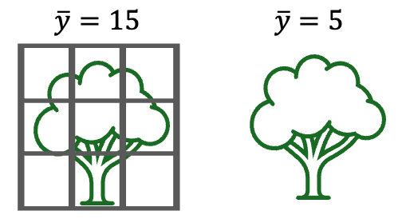
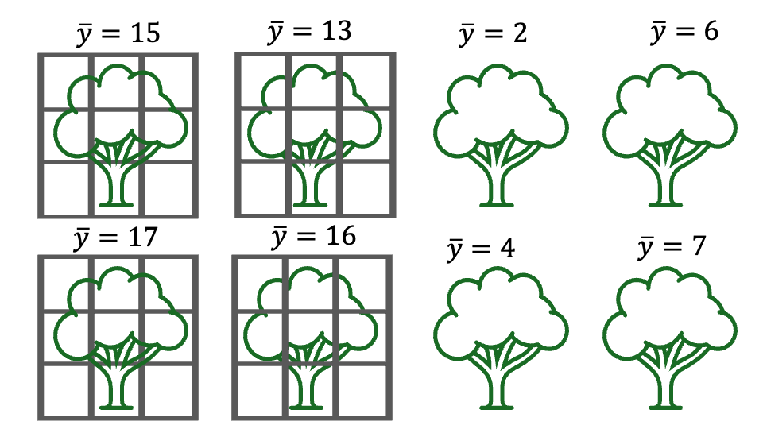
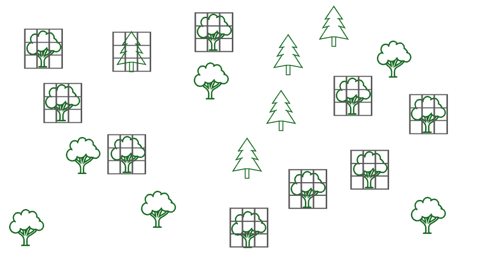
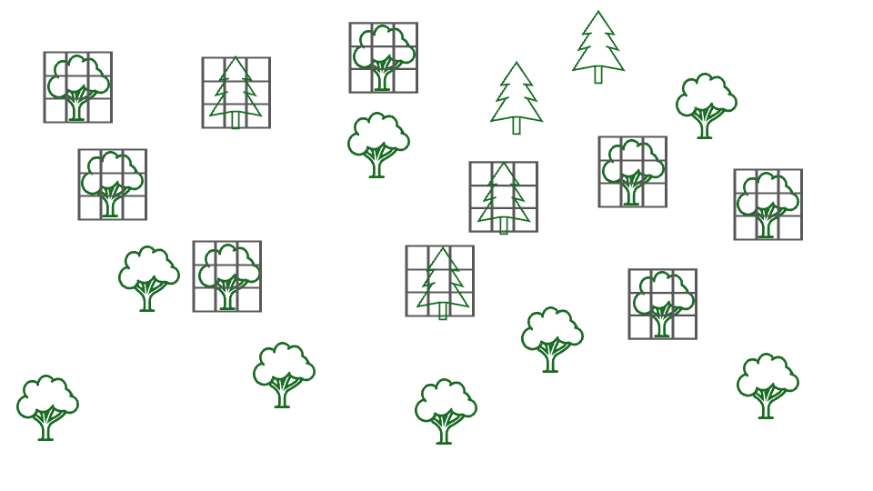
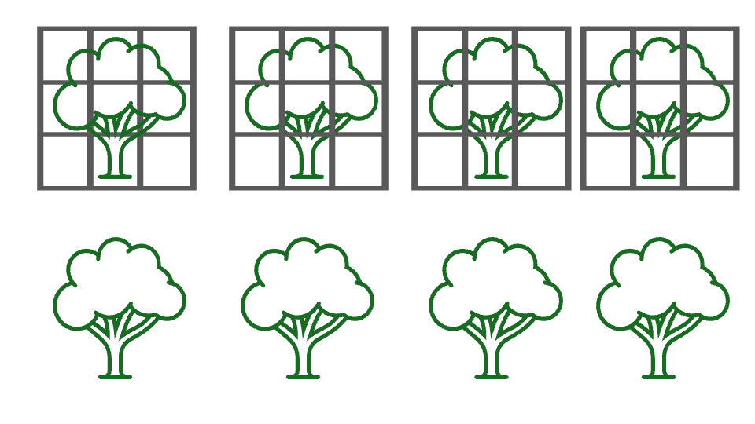
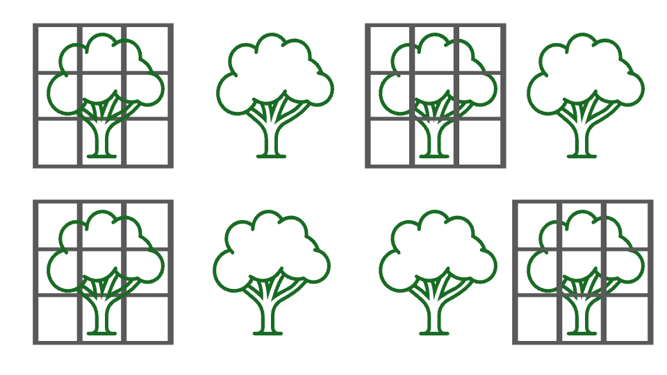

```{r setup, echo = FALSE, include=FALSE}
options(htmltools.dir.version = FALSE)
knitr::opts_chunk$set(echo = FALSE, fig.align = 'center', warning=FALSE, message=FALSE, fig.retina = 2)
source(here::here("R/zzz.R"))
# library(emo)
# library(gganimate)
```

class: inverse

# outline

<br/>
1) Overview

<br/> 
--

2) Replication

<br/> 
--

3) Randomization

<br/> 

--

4) Controls

<br/> 

---
# types of experiments

#### What is an experiment?

--

> A scientific procedure undertaken to make a discovery, test a hypothesis, or demonstrate a known fact

--

Generally, experiments fall into one of three types:

1) Manipulative experiment

2) Quasi-experiment

3) Mensurative experiment (i.e., observational)

--

#### The principles discussed in this lecture are important for understanding the differences between these types, and the limitations of each

---
# components of an experiment

</br>

#### Regardless of type, all experiments require:

1) Hypothesis  

2) Experimental design  

3) Experimental execution  

4) Statistical analysis  

5) Interpretation  

--

#### Which of these do you think is most important? Which takes the most time?

---
# experimental design

#### What is experimental design?

--

1) The number, type, and arrangement of experimental units

--

2) The number and type of treatments

--

3) The assignment of treatments to experimental units

--

4) The response variables that will be measured

---
class: inverse, middle

# the elements of experimental design

---
# elements of experimental design

#### If the goal of experiments is to test a hypothesis, a good experiment must:

1) Isolate the effects of the hypothesized treatment variables from other sources of variation 

2) Have a reasonable chance of detecting a treatment effect, if one exists

--

#### The first goal can be generally be met by careful consideration of:

1) Replication

2) Randomization

3) Controls

--

We will discuss the second goal in another lecture

---
# replication

Imagine we are interested in whether predation by birds reduces the abundance of phytophagous insects on trees

To test this hypothesis, we place an wire exclosure around one tree and leave the neighboring tree unmanipulated. We then collect 10 branches from each tree, count the number of insects on each branch, and calculate the average number of insects per branch on each tree

```{r out.width="50%"}

```


--

#### Question: Can these samples test the hypothesis that birds influence insect abundance?

---
# replication

This design is inadequate for testing our hypothesis because it is **unreplicated** (among other reasons)

```{r out.width="40%"}

```


--

#### Why is replication important?

--

- Experimental units will differ from one another, or from their expected value, for many reasons

--

- Without replication, our treatment will *always be confounded* with other sources of variation

--

- Due to this confounding, it is *impossible* to conclude whether observed differences are due to the treatment

---
# replication

Replication is critical because it allows us to quantify how much variation there is between treatments *relative to* all the other sources of variability

```{r out.width="50%"}

```

--

If differences among treatment groups are larger than differences within groups, we are more confident about the treatment effect

--

- We will return to this idea throughout the semester, as it is key to interpreting the output of statistical models

--

#### How does replication help with confounding?

---
# replication

#### Question: Can these samples test the hypothesis that birds influence insect abundance?

```{r out.width="50%"}

```

--

Replication is necessary, but not sufficient, to remove confounding  

--

- Replication, when combined with **randomization**, helps to ensure that treatment effects are not confounded with other sources of variation

--

- For this reason, randomization is arguably the most important component of a good experiment!  

---
# randomization

#### There are two elements to randomization:

1) Random selection of sampling units from the population

- Helps to ensure* that the sample is representative of population 

- Critical for all types of experiments

.footnote[*But does not guarantee!]

--

2) Random allocation of treatments to experimental units

- Helps to ensure* that treatment effects are not confounded with other sources of variability  

- Not possible in quasi-experiments or observational studies. What is the consequence?

---
# randomization

As discussed previously, samples (and the statistics calculated from samples) allow us to learn about populations

--

Sample statistics will only provide accurate (i.e., unbiased) estimates of population parameters if the sample is *representative* of the population

--

Random selection of sample units is one way to generate samples that are representative of the population 

```{r samp, fig.width=6, fig.height=3}
set.seed(43049)
x <- seq(from = 0, to = 100, length.out = 100)

delta_df <- data.frame(x = x, 
                       y = dnorm(x, 40, 10))

samp_df <- data.frame(y2 = c(rnorm(40, 40, 10)))
mean_df <- data.frame(x = mean(samp_df$y2))
ggplot() +
  geom_histogram(data = samp_df, aes(x = y2, y = ..density..), 
                 color = "white", alpha = 0.6) +
  geom_path(data = delta_df, aes(x = x, y = y), size = 1.25, alpha = 0.5) +
  geom_rug(data = samp_df, aes(x = y2), sides = "b") +
  geom_vline(data = mean_df, aes(xintercept = x), size = 1) +
  scale_x_continuous("") +
  scale_y_continuous("") +
  labs(subtitle = "Random samples (n = 40)")
```


---
class: inverse

# a note on bias and expectations

--

Sample statistics from truly randomized sampling provide **unbiased** estimators of population parameters

--

In this context, *unbiased* simply means that, **on average**, the sample statistics are expected to be equal to the population parameters

--

- Put another way, the expected value of the sample statistics is the population parameter, e.g.,

$$\Large E[\bar{y}] = \mu$$

--

But this *statistical expectation* does not mean that the statistics from any particular sample will be equal to the population parameters, only that the sample statistics are no more likely to overestimate than to underestimate the population parameters

--

This is a critical point that we will return to throughout the semester

---
# randomization

In our previous example, imagine we could only reach branches near the bottom of the trees, so all of our samples came from this region

```{r out.width="50%"}

```

--

Are these samples sufficiently randomized? 

--

How could we revise our protocol to achieve a more representative sample?

---
# randomization

In some cases, completely random sampling is not sufficient to obtain representative samples

--

*Example*: Suppose the study area where we are conducting our exclosure experiments is composed of both oak and fir trees. We have enough money to build 10 exclosures so we randomly select 10 trees to receive the treatment

```{r out.width="50%"}

```

--

#### Questions: What is the "population" in this example? Are these samples likely to representative of that population?


---
# randomization

In cases where sampling units can be divided into discrete groups, *stratified random sampling* is often used to ensure representative samples

```{r out.width="50%"}

```

Stratified random sampling consists of:

1) Dividing sampling units into groups

2) Deciding how to allocate sampling effort across groups (often proportional to % of population)

3) Randomly selecting sampling units within each group

---
# randomization

Stratified random sampling helps ensure that our sample, and corresponding sample statistics, are representative of the overall population

--

Also helps ensure that replication within groups is adequate to test for different responses across groups

--

Other types of sampling are also possible and sometimes used, including

- Cluster sampling

- Systematic sampling

- See Quinn textbook (section 7.1.1) for more details

---
# randomization

Random sampling is not always possible for a variety of reasons, including:

- Logistical/financial constraints

- Safety issues

- Ethics

--

#### Question: Are there examples in your research where samples cannot be selected randomly?

--

#### What are the consequences of non-random sampling for statistical inference?

---
# randomization

Random allocation of treatments to experimental units is also a critical aspect of experimental design

--

This form of randomization helps ensure that treatments are not confounded with other sources of variation. How? By reducing the chance that treaments are correlated with other sources of variation

--

```{r fig.height = 3, fig.width=4}
samp_df <- data.frame(x = runif(100), 
                      y = runif(100),
                      Trait = rnorm(1000))

ggplot(samp_df, aes(x = x, y = y, color = Trait)) +
  geom_point() +
  theme_void() 
```

---
# randomization

Random allocation of treatments to experimental units is also a critical aspect of experimental design


This form of randomization helps ensure that treatments are not confounded with other sources of variation. How? By reducing the chance that treaments are correlated with other sources of variation


```{r fig.height = 3, fig.width=4}
samp1 <- sample(1:100, 20)
samp2 <- sample(seq(1, 100)[-samp1], 20)
ggplot() +
  geom_point(data = samp_df, aes(x = x, y = y, color = Trait)) +
  geom_point(data = samp_df[samp1,], aes(x = x, y = y), shape = 21, fill = NA, color = "black", size = 5) +
  geom_point(data = samp_df[samp2,], aes(x = x, y = y), shape = 21, fill = NA, color = "red", size = 5) +
  theme_void() 
```

---
# randomization

Random allocation of treatments to experimental units is also a critical aspect of experimental design


This form of randomization helps ensure that treatments are not confounded with other sources of variation. How? By reducing the chance that treaments are correlated with other sources of variation


```{r fig.height = 3, fig.width=7}

p <- ggplot() +
  geom_point(data = samp_df, aes(x = x, y = y, color = Trait)) +
  geom_point(data = samp_df[samp1,], aes(x = x, y = y), shape = 21, fill = NA, color = "black", size = 5) +
  geom_point(data = samp_df[samp2,], aes(x = x, y = y), shape = 21, fill = NA, color = "red", size = 5) +
  theme_void() 

samp_df2 <- dplyr::bind_rows(samp_df[samp1,], samp_df[samp2,])
samp_df2$Treatment <- rep(c("A", "B"), each = 20)

q <- ggplot(samp_df2, aes(x = Treatment, y = Trait)) +
  geom_boxplot() +
  geom_point(alpha = 0.5) 

cowplot::plot_grid(p, q, nrow = 1)
```

As before, randomized designs help reduce the risk of confounding, but do not guarantee it

---
# randomization vs interspersion

It is important to note that randomization is a *method* for reducing for confounding, not a *goal* in and of itself

--

An example to illustrate the difference. Assume in our previous example that we randomly selected trees for the exclosure experiment and ended up with the following design: 

```{r out.width="50%"}

```

--

#### Questions: Is this a good experimental design? How should we proceed? 

---
# randomization vs interspersion

#### This design is random but it is not *interspersed*

```{r out.width="50%"}

```

--

#### Random sampling can result in clustered designs, especially with small sample sizes 

--

#### How should we proceed? We could re-randomize...

---
# randomization vs interspersion

#### Is this sample adequately interspersed? Is potential for confounding minimized?

```{r out.width="50%"}

```

--

#### One risk of re-randomizing to achieve interspersion is that we risk re-randomizing until we get a design that "looks" random/interspersed  

--

- Do we still have a randomized design?

--

- Pre-defined criteria can help reduce potential for randomizing your way to a non-randomized design

---
# randomization vs interspersion

Another option is to use regular/systematic allocation of treatments

```{r out.width="45%"}

```

--

Systematic/regular allocation can be more appropriate to achieve adequate interspersion, but risks of confounding remain

--

Often, final design will be compromise between randomization, risk of confounding, and logistical constraints

- No easy answer

- Make decisions ahead of time, document process, and be transparent

---
# controls

Another component of good experiments is the use of **controls**

--

If our goal is to determine whether a change in $\large x$ causes a corresponding change in $\large y$, controls allow us to answer the question: 

> What would happen to $\large y$ if we didn't change $\large x$? 

--

- This is called a *counterfactual*

---
# controls

**Example:** We are interested in whether two closely related salamander species compete with each other. To test this, we establish study plots and count the number of individuals of the focal species in each plot. After four years, we randomly select half the plots and remove all individuals of the other species. We then monitor abundance of the focal species for 4 more years (ensuring no individuals of the other species re-colonize the plots)

- In this case, one might use the "before" and "after" periods as treatments to test for an effect

```{r fig.width= 5, fig.height=2}
sal_data <- data.frame(Year = c(1,2,3,4,5,6,7, 8),
                       Count = c(42, 43, 41, 44, 47, 51, 52, 55,
                                 43, 42, 43, 44, 48, 50, 53, 54),
                       Treatment = rep(c("Competitor removed", "Control"), each = 8))

ggplot(sal_data[sal_data$Treatment == "Competitor removed",], aes(x = Year, y = Count, color = Treatment)) +
  geom_vline(xintercept = 4, color = "grey30", linetype = "longdash") +
  geom_path() +
  geom_point() +
  scale_x_continuous(breaks = 1:8)

```

Question: Does our data provide evidence that the species compete?

---
# controls

Although it seems clear that abundance increased after the competitor was removed, we do not know what would have happened if we hadn't remove the competitor (i.e., the counterfactual)

--

The plots where the competitor wasn't removed serve as controls, allowing us to formally test whether the response variable changed in the absence of the treatment

```{r fig.width= 6, fig.height=3}
ggplot(sal_data, aes(x = Year, y = Count, color = Treatment)) +
  geom_vline(xintercept = 4, color = "grey30", linetype = "longdash") +
  geom_path() +
  geom_point() +
  scale_x_continuous(breaks = 1:8)

```

Question: Does our data provide evidence that the species compete?

---
# controls

The purpose of controls are to eliminate all sources of variation *except* the treatment

--

Although straightforward in concept, creating suitable controls is often very challenging in practice

--

Are the following examples adequate controls?

- To test the effects of an experimental drug, researchers capture individuals and inject the drug via a syringe. Control individuals are not captured or given the drug. Survival of both groups is monitored 

--

- Researchers are trying to establish a new population of an endangered species via translocation to restored habitat. To test reproductive success is lower in the restored habitat, researchers monitor nests of translocated and non-translocated individuals

--

- Researchers test the effectiveness of a new pesticide by spraying randomly selected plants and not spraying others. Insect damage is quantified on both groups

---
# summary


The three main elements of experimental design are:

--

1) Replication

- Confounding cannot be eliminated in un-replicated experiments  

- Allows quantifying within and among group variation, necessary for statistical tests

- More replication = better. Why?

- Can be challenging/impossible in large-scale field experiments

---
# summary


The three main elements of experimental design are:


1) Replication


2) Randomization

- Random selection of sampling units produces representative samples

- Random allocation of treatments to experimental units reduces risk of confounding

- Alternative sampling methods (stratified, clustering, systematic) are sometimes preferred to complete randomization

- When sample sizes are small, randomization can result in inadequate interspersion; alternative designs often necessary 

- The inability to randomize treatments is what distinguishes manipulative experiments from quasi-experiments and observational studies. What is the consequence for inference?

---
# summary


The three main elements of experimental design are:


1) Replication


2) Randomization


3) Controls

- Controls are necessary to evaluate response in the absence of treatment

- Important in manipulative and observational experiments

- Suitable controls eliminate all sources of variation except the treatment effect. Not always easy/possible to achieve

---
# summary


The three main elements of experimental design are:


1) Replication


2) Randomization


3) Controls

#### Well-designed experiments are essential to test hypotheses

- Plan ahead! Design choices must be made before data collection begins

- No amount of fancy statistical methodology can compensate for a poorly designed experiment!

- Other considerations (sample sizes, independence, logistical constraints, appropriate response variables) are also important

---
# looking ahead

<br/>

### **Next time**: Linear models part 1: categorical predictor w/ 2 levels

<br/>

### **Reading**: [Fieberg chp. 3.6](https://statistics4ecologists-v3.netlify.app/03-multipleregression#categorical-predictors)

