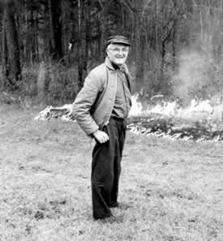
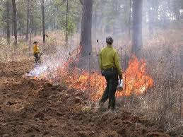

```{r setup, echo = FALSE, include=FALSE}
options(htmltools.dir.version = FALSE)
knitr::opts_chunk$set(echo = FALSE, fig.align = 'center', warning=FALSE, message=FALSE, fig.retina = 2)
source(here::here("R/zzz.R"))
library(emo)
library(FANR6750)
library(dplyr)
library(kableExtra)
data("firedata")
# library(gganimate)
```

class: inverse

# outline

#### 1) Model structure

<br/>  
--

#### 2) Factor + continuous predictor (ANCOVA)

<br/> 
--

#### 3) Two factors (blocking design)

<br/> 

--

#### 4) Two continuous predictors

<br/> 

--

#### 5) Centering predictors

---
# review

$$\large y_i = \beta_0 + \beta_1 \times X_i + \epsilon_i$$
$$\large \epsilon_i \sim normal(0, \sigma)$$
So far, we have learned about linear models that contain only a single predictor variable $X$:

1) Single continuous variable = "simple" regression (lecture 2)

2) Single categorical predictor w/ one level = one-sample *t*-test (lecture 5)

3) Single categorical predictor w/ two levels = two-sample *t*-test (lecture 5)

4) Single categorical predictor w/ > 2 levels = ANOVA (lecture 8)

--

More often than not, your models will need to contain more than one predictor

---
# multiple regression

Models with more than one predictor go by many names (blocking, ANCOVA, factorial, etc) but are all types of *multiple regression* of the form:

$$\Large y_i = \beta_0 + \beta_1 \times X1_i + \beta_2 \times X2_i + \epsilon_i$$
$$\Large \epsilon_i \sim normal(0, \sigma)$$

\*Note that this model only contains two predictors but multiple regression models often contain many predictors 

--

Interpretation of the intercept $\beta_0$, residual error $\epsilon_i$, and residual variance $\sigma$ remains the same as before

--

Interpretation of the slope coefficients $\beta_1$, $\beta_2$, etc. changes *slightly*

--

- Slopes are the expected change in the response variable $y_i$ for a unit change in the corresponding predictor variable *while holding all other predictors constant*

--

- This is a subtle difference but an important one


---
# example

One of the most common reasons for using multiple regression models is to control for extraneous sources of variation (i.e., sources of variation that influence the response variable but are not of interest in and of themselves)

--

Why would we want to control for extraneous variation? 

--

Perhaps we are raising desert tortoises (*Gopherus agassizii*) for release into the wild and are interested in whether different diets influence their weight gain

.pull-left[
```{r out.width="80%", out.height="80%"}
knitr::include_graphics("https://upload.wikimedia.org/wikipedia/commons/d/dc/Desert_Tortoise_%28Gopherus_agassizii%292.jpg")
```
]

.pull-right[
```{r fig.width=5, fig.height=3.75}
data(dietdata)
ggplot(dietdata) +
  geom_boxplot(aes(x = diet, y = weight)) +
  scale_x_discrete("Diet") +
  scale_y_continuous("Weight (g)")
```
]

---
# example

A tortoises final weight, however, is not influenced only by diet. For example, it may also be influenced by it's starting body size

```{r fig.width=5, fig.height=3.75}
ggplot(dietdata) +
  geom_point(aes(x = length, y = weight)) +
  scale_x_continuous("Initial length (mm)") +
  scale_y_continuous("Weight (g)")
```

--

As we will see, accurately measuring the effect of diet requires taking into account each individual's initial body size. Multiple regression allows us to do this

---
# anova

Let's start by fitting a model we've already learned about:

--

.vsmall-code[

```{r echo = TRUE}
fit.lm <- lm(weight ~ diet, data = dietdata)
summary(fit.lm)
```

]

--

Conclusions?

---
# "ancova"

Now let's fit a slightly different model:

--

.vsmall-code[

```{r echo = TRUE}
fit.lm2 <- lm(weight ~ diet + length, data = dietdata)
summary(fit.lm2)
```

]


--
What changed?

---
# signal vs. noise

$$\large y_i = \beta_0 + \beta_1 X1_i + \beta_2 X2_i + \epsilon_i$$

In any statistical test, our goal is to detect a signal ( $\beta$ ) in the presence of noise (residual variation $\epsilon$)

--

Our ability to do that depends on the strength of the signal (usually beyond our control) and the amount of noise (partially within our control)

--

- In the first model, where was all the variation in weight caused by variation in length?

- We can see this clearly by looking at the ANOVA tables for the two models

---
# anova tables

.small-code[
```{r echo = TRUE}
anova(fit.lm)
```

```{r echo = TRUE}
anova(fit.lm2)
```
]

--

Note the residual sum of squares and mean square error of the two models 

---
class:inverse
# sums of squares

When calculating the sums of squares for multiple regression models, the order that we write the model matters

--

We wrote the model formula with diet first and length second (`weight ~ diet + length`). `R` calculates the sums of squares for diet first, then length 

- Notice that the diet SS in the two previous tables are the same

--

If we wrote `weight ~ length + diet`, `R` calculates the length SS first, then the diet SS

- The diet SS tells us how much variation is explained by the treatment variable **after** accounting for the covariate

--

This *sequential* method of calculating is called the Type I sums of squares

- Type I SS is the default used by `R`


---
class:inverse
# sums of squares

.small-code[

```{r echo = TRUE}
anova(fit.lm2)
```

```{r echo = TRUE}
fit.lm3 <- lm(weight ~ length + diet, data = dietdata)
anova(fit.lm3)
```
]

---
class:inverse
# sums of squares


Type I SS is only one of several ways of calculating sums of squares

--

- Type II and Type III SS use slightly different methods that do not depend on order

--

- For balanced designs, all three approaches will give the same answers

--

- For unbalanced designs, the correct approach depends on the hypotheses being tested

--

- Other software programs (SAS, SPSS) default to Type III so may give different results than `R` (but all programs have methods to calculate SS using each method)

---
# another example

In 1960, Herbert Stoddard established an experiment at Tall Timbers Research Station to study the effects of fire frequency on long-leaf pine forests in the Red Hills region of north Florida and southwest Georgia. The experiment originally consisted of eighty four, 0.5ha plots, each of which was assigned one of four treatments: 1-year, 2-year, or 3-year fire intervals or unburned. Stoddard recognized the soil type likely influenced response to fire, so treatment plots were allocated across the 3 primary soil types found on Tall Timbers

.pull-left[

```{r stoddard_pic, out.width="60%", fig.align="c"}

```

]

.pull-right[

```{r fire_pic, out.width="80%", fig.align="c"}

```

]
---
# another example

We will use a made-up data set from this real experiment, with the goal of understanding whether understory plant richness (measured as the number of understory vascular plant species recorded on each plot) differs among burn treatments.

```{r fire1, echo = FALSE}
fire_tab <- data.frame(Replicate = c("1", "2", "3"),
           Unburned = as.character(c(30, 28, 18)),
           One = as.character(c(43, 37, 27)),
           Two = as.character(c(36, 30, 24)),
           Three = as.character(c(37, 27, 21)),
           Soil = c("Loamy sand", "Sandy loam", "Upland"))

fire_tab %>%
  kable("html", align = 'c', 
        col.names = c("Replicate", "Unburned", "1-year", "2-year", "3-year", "Soil")) %>%
  kable_styling(bootstrap_options = c("condensed"),
                full_width = FALSE, font_size = 14) %>%
  add_header_above(c(" " = 1, "Fire frequency" = 4, " " = 1))
```


--

What are the experimental units? What are the observational units?

---
# another example

Fit the model with treatment only:

```{r echo = TRUE}
data("firedata")
fm1 <- lm(species ~ interval, data = firedata)
anova(fm1)
```

Conclusions?


---
# another example

Because the soil types differ in a variety of ways that may influence plant communities, we probably want to control for this variability in our analysis

We do that by adding it to the model:

.small-code[
```{r echo = TRUE}
data(firedata)
fm2 <- lm(species ~ interval + soil, data = firedata)
anova(fm2)
```
]

Conclusions?

---
# another example

Note that in this case, each treatment is applied exactly once within each soil type

--

Soil type itself is not a experimental treatment and is not replicated

--

This design is often referred to as a "randomized complete blocking" design (RCBD)

- The soil types are called "blocks" and should be identified as a source of variability **before** the experiment is conducted

- "Complete" refers to each treatment being represented in each block

- "Randomized" means that treatments are assigned randomly to each experimental unit

--

Again, blocks must be identified during the design phase. You should not "search" for blocks after the fact (why?)

---
# multiple regression

As these examples show, one reason to use a multiple regression model is to increase power to detect treatment effects

- Remember that $F = MS_{treatment}/MS_{error}$ 

- By explaining some of the residual variation, including predictors in the model reduces $MS_{errer}$ and thereby increases $F$

--

- When one predictor is a factor and the other(s) is continuous, this model is often referred to as an *ANCOVA* (**An**alysis of **Cova**riance)

--

- When both predictors are factors and each treatment is included within each block, this model is often referred to a randomized complete block design

--

In experimental setting, ANCOVA and blocking are used when there is extraneous variation that we cannot control during the design phase

- Predictor/blocks are not of interest; only included to increase power


---
# interpreting model output

If we are only interested in the treatment effect and not the blocks/continuous predictor, the ANOVA table (possibly in combination with multiple comparisons) is often sufficient for interpreting the model

- This is often the case in experimental settings  

--

However, in observational studies, we are often interested in the effects of both predictors

- In this case, it helps to understand the model structure and parameter interpretation in more detail 

--

- Understanding how multiple regression models are structured will also help when you need to include different combinations of factors and continuous predictors

--

Luckily, you already have the tools exploring these models in detail...

---
# interpreting the ancova model

.small-code[
```{r echo = TRUE}
broom::tidy(fit.lm2)
```
]

--

- `Intercept` = predicted weight of control group **when length = 0**

--

- `dietLow` = difference between control and low diet

--

- `dietMed` = difference between control and medium diet

--

- `dietHigh` = difference between control and high diet

--

- `length` = predicted increase in weight for one unit increase in length

---
# interpreting the ancova model

```{r fig.height=5, fig.width=7}
ancova <- lm(weight ~ diet + length - 1, data = dietdata)

ancova_df <- data.frame(diet = factor(c("Control", "Low", "Med", "High"), 
                                      levels = c("Control", "Low", "Med", "High")),
                        slope = coef(ancova)[5],
                        intercept = coef(ancova)[1:4])
ggplot(dietdata, aes(x = length, y = weight, color = diet)) +
  geom_point() +
  scale_x_continuous("Length", limits = c(0, 20)) +
  scale_y_continuous("Weight") +
  geom_abline(data = ancova_df, aes(slope = slope, intercept = intercept, color = diet)) +
  geom_vline(xintercept = 0) +
  geom_segment(aes(x = 1.5, xend = 0, y = 180, yend = 191.4), 
               alpha = 0.5, linewidth = 0.2, color = "#446E9B") +
  annotate("text", label = "(Intercept)", x = 1.60, y = 180, hjust = 0, color = "#446E9B") +
  geom_segment(aes(x = 1, xend = 1, y = 194.7, yend = 207.7),
               arrow = arrow(length = unit(0.02, "npc"), ends = "both"), color = "#D47500") +
  geom_segment(aes(x = 2.2, xend = 1, y = 188, yend = 202),
               color = "#D47500", alpha = 0.5, linewidth = 0.2) +
  annotate("text", label = "dietLow", x = 2.3, y = 188, hjust = 0, color = "#D47500") +
  geom_segment(aes(x = 2, xend = 2, y = 197, yend = 221.5),
               arrow = arrow(length = unit(0.02, "npc"), ends = "both"), color = "#3CB521") +
  geom_segment(aes(x = 3.2, xend = 2, y = 195, yend = 210),
               color = "#3CB521", alpha = 0.5, linewidth = 0.2) +
  annotate("text", label = "dietMed", x = 3.3, y = 195, hjust = 0, color = "#3CB521") +
  geom_segment(aes(x = 3, xend = 3, y = 200, yend = 230),
               arrow = arrow(length = unit(0.02, "npc"), ends = "both"), color = "#CD0200") +
  geom_segment(aes(x = 4.3, xend = 3, y = 248.1, yend = 220),
               color = "#CD0200", alpha = 0.5, linewidth = 0.2) +
  annotate("text", label = "dietHigh", x = 4.4, y = 248.1, hjust = 0, color = "#CD0200") 
```

--

#### Question: does the effect of length depend on diet treatment?

--

#### Answer: No. The model assumes the effect of length is the same for every treatment


---
# interpreting the rcbd model

.vsmall-code[
```{r echo = TRUE}
summary(fm2)
```
]

--

This scenario (two factors) is a little more tricky. But, as before, we'll use the design matrix to help understand what each parameter means

---
# interpreting the rcbd model

.small-code[
```{r echo = TRUE}
model.matrix(fm2)
```
]

---
# interpreting the rcbd model

- `Intercept` = predicted number of species in the unburned treatment in loamy sand

--

- `interval1` = difference between unburned and 1-year fire interval

--

- `interval2` = difference between unburned and 2-year fire interval

--

- `interval3` = difference between unburned and 3-year fire interval

--

- `soilsandy loam` = difference between loamy sand and sandy loam soils

--

- `soilupland` = difference between loamy sand and upland soils

--

Again, because there is no interaction between `interval` and `soil`, the model assumes that the effects of fire frequency are the same in every soil type (and that the soil differences are the same for every fire frequency)

---
# one more example 

We have looked at multiple regression examples with two factors and with one factor and one continuous covariate, but what about multiple continuous covariates?

--

The `biomassdata` object contains (made up) biomass measurements (kg) as a function of rainfall (mm) and elevation (km)

```{r echo = TRUE}
data("biomassdata")
head(biomassdata)
```

---
# multiple regression model


.vsmall-code[
```{r echo = TRUE}
fit.lm <- lm(biomass ~ rainfall + elevation, data = biomassdata)
broom::tidy(fit.lm)
```
]

- `Intercept` = predicted biomass when rainfall = 0 and elevation = 0

--

- `rainfall` = predicted change in biomass for 1mm increase in rainfall while holding elevation constant

--

- `elevation` = predicted change in biomass for 1km increase in elevation while holding rainfall constant

---
# centering and standardizing data

When fitting models to continuous covariates, it is common to center or standardize covariates. 

--

Centering is done by subtracting the mean

.small-code[
```{r echo = TRUE}
biomassdata$elevation.c <- biomassdata$elevation - mean(biomassdata$elevation)
biomassdata$rainfall.c <- biomassdata$rainfall - mean(biomassdata$rainfall)
```
]

--

When interpreting centered data:

- positive values indicate observations larger than the mean

- negative values indicate observation smaller than the mean

- units don't change

---
# multiple regression model


.vsmall-code[
```{r echo = TRUE}
fit.lm <- lm(biomass ~ rainfall.c + elevation.c, data = biomassdata)
broom::tidy(fit.lm)
```
]

- `Intercept` = predicted biomass when rainfall and elevation are **at their mean**

--

- `rainfall` = predicted change in biomass for 1mm increase in rainfall while holding elevation constant

--

- `elevation` = predicted change in biomass for 1km increase in elevation while holding rainfall constant


---
# multiple regression model

```{r fig.height=6, fig.width=8}
fit.lm <- lm(biomass ~ rainfall + elevation, data = biomassdata)

newdat.r <- data.frame(rainfall = seq(0, 230), elevation = mean(biomassdata$elevation))
pred.r.df <- data.frame(rainfall = newdat.r$rainfall,
                        biomass = predict(fit.lm, newdat.r))

ggplot(biomassdata, aes(x = rainfall, y = biomass)) +
  geom_point() +
  geom_vline(xintercept = c(0, mean(biomassdata$rainfall)), 
             linetype = "dashed", 
             color = "grey40") +
  geom_line(data = pred.r.df) +
  scale_x_continuous(breaks = c(0, mean(biomassdata$rainfall))) +
  scale_y_continuous(limits = c(0, 325))
```

---
# looking ahead

<br/>

### **Next time**: Interactions

<br/>

### **Reading**: [Fieberg chp. 3.8](https://statistics4ecologists-v3.netlify.app/03-multipleregression#models-with-interactions)

