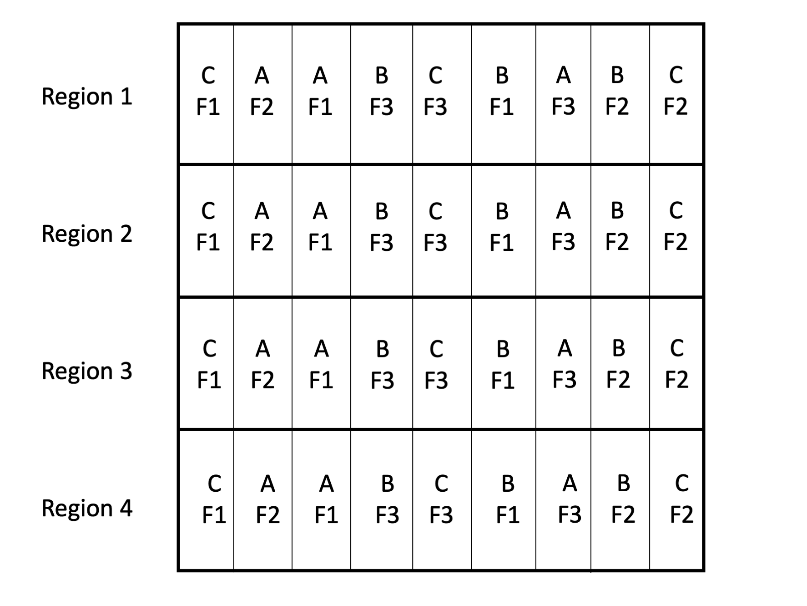
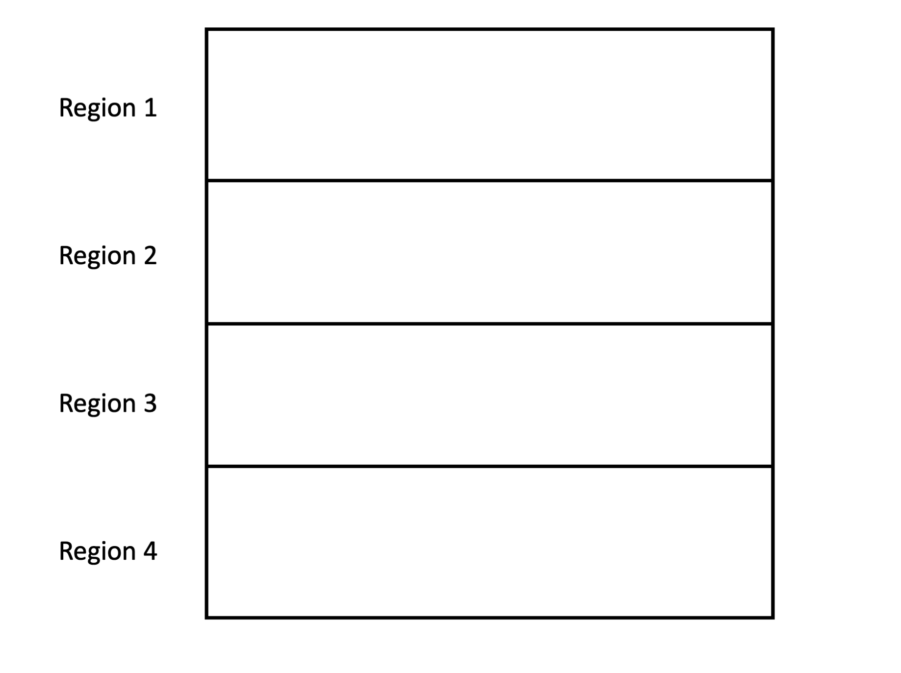
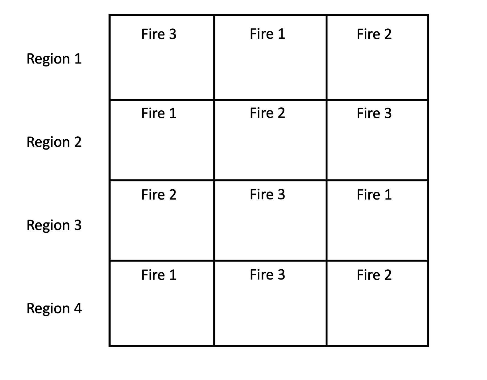
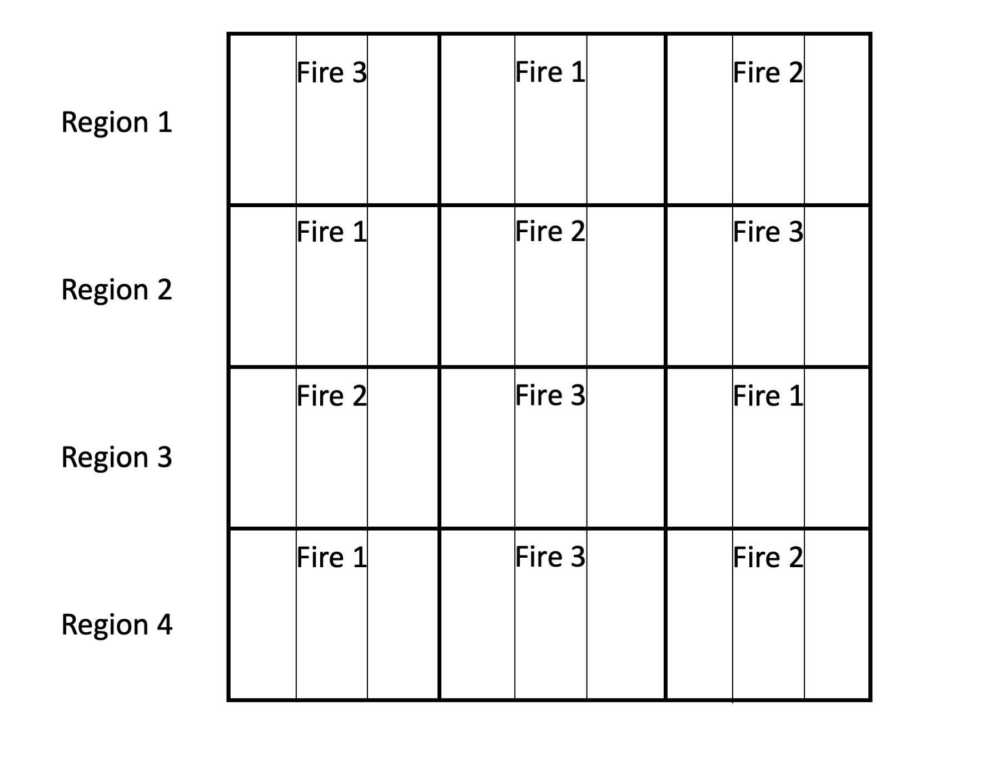
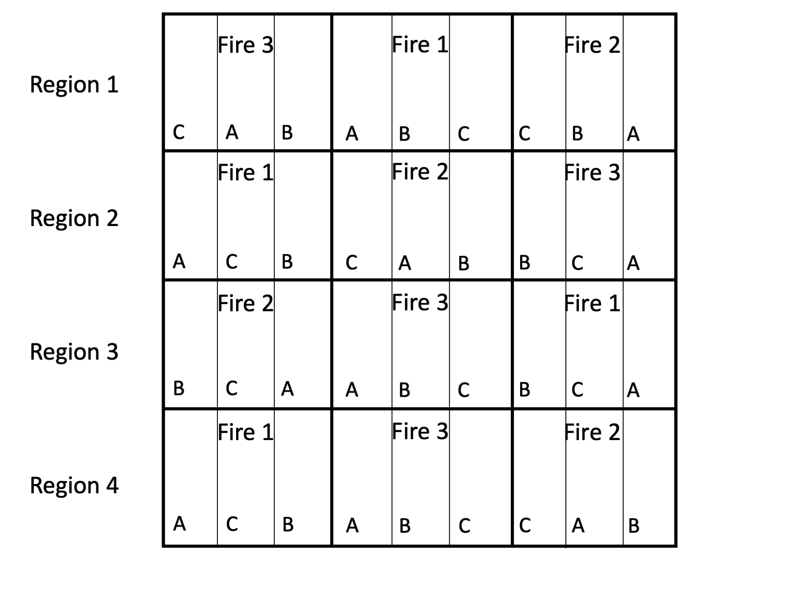
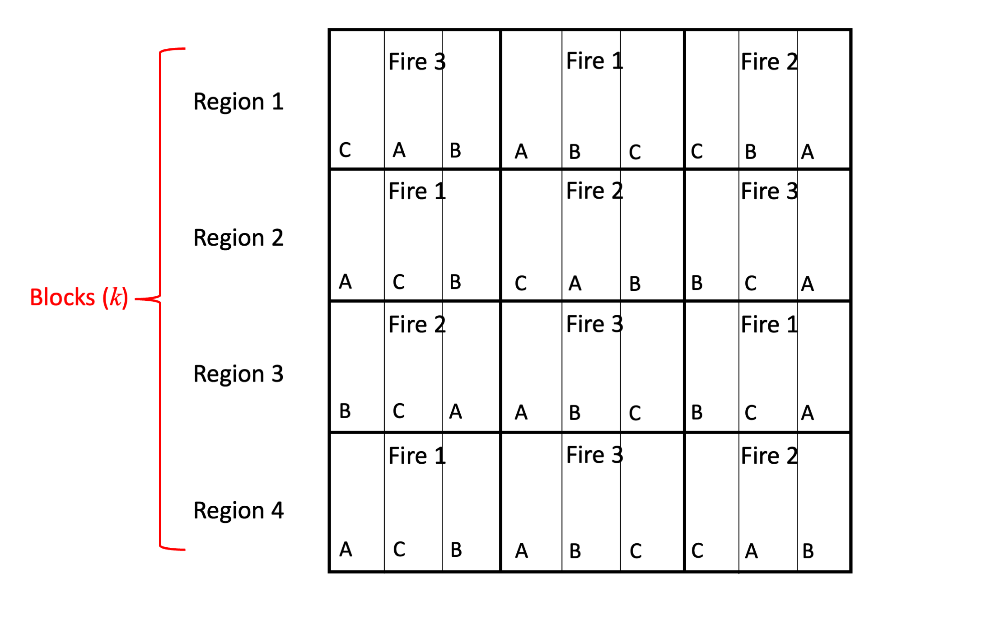
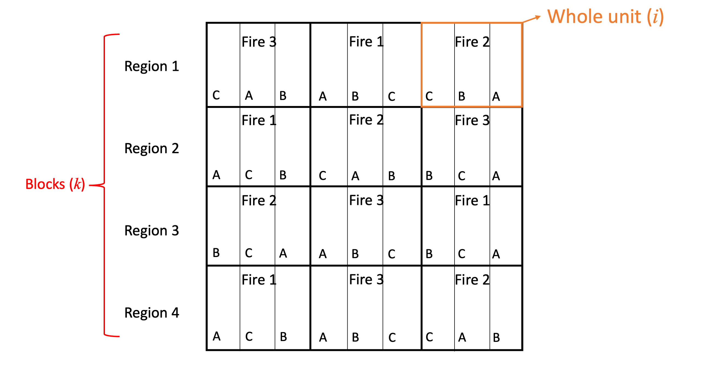
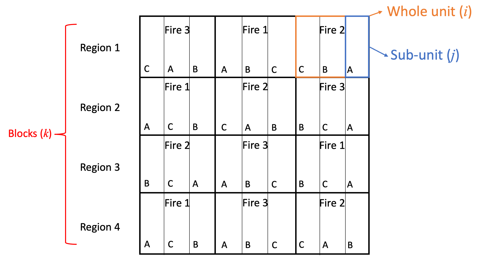

```{r setup, echo = FALSE, include=FALSE}
options(htmltools.dir.version = FALSE)
knitr::opts_chunk$set(echo = FALSE, fig.align = 'center', warning=FALSE, message=FALSE, fig.retina = 2)
source(here::here("R/zzz.R"))
library(emo)
library(FANR6750)
library(dplyr)
library(kableExtra)
# library(gganimate)
```

# outline 

1) Motivation

<br/>

--

2) Model

<br/>

--

3) Procedure

<br/>

--

4) Example


---
# motivation

Suppose we are interested in how fire intensity (high, medium, low) and genotype (type A, B, or C) influence regrowth after prescribed burns. There would be 9 treatment level combinations in a 2-way factorial design. We would then randomly allocate 1-ha units to the different combinations. With replication (say, in blocks) this is a large effort  

```{r out.height="60%", out.width="60%"}

```

---
# another approach

Let's imagine a different design, build from scratch. 

--

Start with blocks to capture extraneous variation in regrowth rate (e.g., soil type, moisture)

```{r out.height="60%", out.width="60%"}

```

---
# another approach

Within each block, we delineate large areas to receive each fire treatment. 

```{r out.height="60%", out.width="60%"}

```

--

#### What design in this?


---
# another approach

Next, we divide each fire treatment into three sub-units

```{r out.height="60%", out.width="60%"}

```

---
# another approach

Within each fire treatment, we randomly assign each genotype to a sub-unit. 

If we only focus within one region, what design is this? 

```{r out.height="60%", out.width="60%"}

```

--

The resulting design is called a **split-plot design**

---
# another approach

Notice that we have three levels of "units":

- blocks

```{r out.height="80%", out.width="80%"}

```

---
# another approach

Notice that we have three levels of "units":

- blocks

- whole-units

```{r out.height="80%", out.width="80%"}

```

---
# another approach

Notice that we have three levels of "units":

- blocks

- whole-units

- sub-units 

```{r out.height="80%", out.width="68%"}

```


---
# key points


#### A standard split-plot design involves the following:  

--

- We apply two (or more) treatments to two types of experimental units: whole-units and sub-units  

<br/>

--

- Whole units are (often) arranged in blocks to account for extraneous sources of variation  

<br/>

--

- We're interested in the effects of both treatments. Interactions can be tested too, but we are usually not interested in interactions involving the block  

---
# why?


#### Why use a split-plot design instead of a factorial design?  

<br/>

--

1) Sometimes the different factors have to be applied at different scales (e.g., aerial application of pesticides)  

<br/>

--

2) Saves money, space, etc.  


---
class: inverse, middle, center

# model

---
# model

$$\large y_{ijk} = \mu + \alpha_i + \beta_j + \alpha \beta_{ij} + \gamma_k + \delta_{ik} + \epsilon_{ijk}$$

--

$$i = 1, ..., a \;(whole-unit \;treatment \;levels)$$
$$j = 1, ..., b \;(subunit \; treatment\;levels)$$
$$k = 1, ..., c \;(blocks)$$
--

- $\mu =$ grand mean  

- $\alpha_i =$ effect of the $i$th level of factor *A*, the whole unit treatment  

- $\beta_{j} =$ effect of the $j$th level of factor *B*, the subunit treatment  

- $\alpha \beta_{ij} =$ interaction between $i$th level of factor *A* and $j$th level of factor *B*  

- $\gamma_k =$ $k$th block effect  

- $\delta_{ik} =$ whole-unit effect  

- $\epsilon_{ijk} =$ residual, unexplained variation

---
# model

The whole-unit effect $\delta_{ik}$ may look unfamiliar and often causes confusion

--

Remember that the whole-unit "part" of the model is just a RCBD 

.pull-left[
```{r out.height="90%", out.width="90%"}

```
]

--

.pull-right[

We can write the RCBD model as:

$$y_{ij} = \beta_0 + \beta_{1[i]} + \beta_{2[j]} + \epsilon_{ij}$$
$$\epsilon_{ij} \sim normal(0, \sigma^2)$$

where $\beta_{1[i]}$ is the effect of treatment $i$, $\beta_{2[j]}$ is the effect of block $j$, and $\epsilon_{ij}$ is the residual error

]

--

Mathematically, this equation is the same as $y_{ij} = \mu + \alpha_i + \gamma_k + \delta_{ik}$

--

So the "whole-unit effect" is the residual error in the whole unit "part" of the model, i.e., the difference between each whole-unit mean and it's expected value based on the block/treatment combination

---
# model

$$\large y_{ijk} = \mu + \alpha_i + \beta_j + \alpha \beta_{ij} + \gamma_k + \delta_{ik} + \epsilon_{ijk}$$

Because it is essentially the whole-unit residual variance, $\delta_{ik}$ is treated as a random effect:  


$$\large \delta_{ik} \sim normal(0, \sigma^2_\delta)$$

--

We might view block as random too:

$$\large \gamma_k \sim normal(0, \sigma^2_\gamma)$$


--
And as always,

$$\large \epsilon_{ijk} \sim normal(0, \sigma^2)$$

<br/>

--

All other effects in the model are fixed effects  

---
# hypotheses

#### Main hypothesis of interest

$$H_0 : \alpha_1 = \alpha_2 = ... = \alpha_a = 0$$

$$H_a : At \;least \;one \;inequality$$
$$H_0 : \beta_1 = \beta_2 = ... = \beta_b = 0$$

$$H_a : At \;least \;one \;inequality$$

$$H_0 : \alpha \beta_{ij} = 0 \; for \; all \; i \; and \; all \; j$$

$$H_a : At \;least \;one \;inequality$$

#### Secondary hypotheses

$$H_0 :\sigma^2_{\gamma} = 0\; or\;\sigma^2_\delta = 0$$

$$H_a :\sigma^2_\gamma > 0\;or\;\sigma^2_\delta > 0$$

---
class: inverse, middle, center

# procedure

---
# anova table

<br/>

#### In setting up the ANOVA table for the split-plot design, I like to think of the design having a whole-unit part and a subunit part, each with its own design.


---
# anova table

First, the whole-unit part. Does it look familiar?

```{r anova_tab}
anova_tab <- data.frame(Source = c("Whole units", "   Factor A", "   Block", "   Whole unit remainder"),
                        df = c(' ', '\\(a-1\\)', '\\(c-1\\)', '\\((a-1)(c-1)\\)'),
                        SS = c(' ', '\\(SS_a\\)', 
                               '\\(SS_c\\)',
                               '\\(SS_{WUR}\\)'),
                        MS = c(' ', '\\(\\frac{SS_a}{a-1}\\)', '\\(\\frac{SS_c}{c-1}\\)',
                               '\\(\\frac{SS_{WUR}}{(a-1)(c-1)}\\)'),
                        F = c(' ', '\\(\\frac{MS_a}{MS_{WUR}}\\)', '\\(\\frac{MS_c}{MS_{WUR}}\\)', ' '))

anova_tab %>%
  kable(align = c('r', 'c', 'c', 'c', 'c'), booktabs = TRUE, escape = FALSE, format = "html") %>%
  kable_styling(bootstrap_options = c("condensed"), 
                full_width = TRUE, font_size = 13)  %>%
  row_spec(1, bold = TRUE,align = 'l', font_size = 15)
```

---
# anova table

```{r anova_tab2}
anova_tab <- data.frame(Source = c("Whole units", "   Factor A", "   Block", "   Whole unit remainder"),
                        df = c(' ', '\\(a-1\\)', '\\(c-1\\)', '\\((a-1)(c-1)\\)'),
                        SS = c(' ', '\\(SS_a\\)', 
                               '\\(SS_c\\)',
                               '\\(SS_{WUR}\\)'),
                        MS = c(' ', '\\(\\frac{SS_a}{a-1}\\)', '\\(\\frac{SS_c}{c-1}\\)',
                               '\\(\\frac{SS_{WUR}}{(a-1)(c-1)}\\)'),
                        F = c(' ', '\\(\\frac{MS_a}{MS_{WUR}}\\)', '\\(\\frac{MS_c}{MS_{WUR}}\\)', ' '))

anova_tab %>%
  kable(align = c('r', 'c', 'c', 'c', 'c'), booktabs = TRUE, escape = FALSE, format = "html") %>%
  kable_styling(bootstrap_options = c("condensed"), 
                full_width = TRUE, font_size = 13)  %>%
  row_spec(1, bold = TRUE,align = 'l', font_size = 15)
```

```{r anova_tab3}
anova_tab <- data.frame(Source = c("Subunits", "   Factor B", "   Interaction", "   Subunit remainder"),
                        df = c(' ', '\\(b-1\\)', '\\((a-1)(b-1)\\)', '\\(a(b-1)(c-1)\\)'),
                        SS = c(' ', '\\(SS_b\\)', 
                               '\\(SS_i\\)',
                               '\\(SS_{e}\\)'),
                        MS = c(' ', '\\(\\frac{SS_b}{b-1}\\)', '\\(\\frac{SS_i}{(a-1)(b-1)}\\)',
                               '\\(\\frac{SS_{e}}{a(b-1)(c-1)}\\)'),
                        F = c(' ', '\\(\\frac{MS_b}{MS_{e}}\\)', '\\(\\frac{MS_i}{MS_{e}}\\)', ' '))

anova_tab %>%
  kable(align = c('r', 'c', 'c', 'c', 'c'), col.names = NULL, booktabs = TRUE, escape = FALSE, format = "html") %>%
  kable_styling(bootstrap_options = c("condensed"), 
                full_width = TRUE, font_size = 13) %>%
  row_spec(1, bold = TRUE,align = 'l', font_size = 15)
```

---
# model fitting

Fitting models for split-plot designs can be done in several ways within `R`.

One way is to use `aov()` to create the ANOVA table. The model will generally follow the structure:

```
fit.aov <- aov(y ~ WU * SU + Block + Error(WUR))
```

where `Block` is the blocking factor ( $\gamma_k$ ), `WU` is the whole-unit treatment ( $\alpha_i$ ), `SU` is the sub-unit treatment ( $\beta_j$ ), and `WUR` is the whole-unit remainder ( $\delta_{ik}$ )

--

This approach will provide the ANOVA table on the previous slide, though `aov()` can only contain 1 random effect so block has to be treated as fixed


---
# model fitting

To include both block and WUR as random effects, it is necessary to fit a mixed-effect model using one of several `R` packages (`lme4` or `nlme`). 

The model can generally be written as:

```
fit.lmm <- fxn(y ~ WU * SU + (1|Block/WUR))
```

though note that the syntax will differ slightly between `lme4` and `nlme`

--

It's also important to note that different functions (and software) will sometimes provide different F-values for the block and WU treatments. This is because the denominator df are based on WUR - which is a random effect - and the correct df for random effects is a [somewhat controversial topic](https://stat.ethz.ch/pipermail/r-help/2006-May/094765.html)  


---
class: inverse, center, middle

# example

---
# example

It's easy to understand the concept of split plots when dealing with plots of land, but nested effects arise in all kinds of settings  

--

Consider a food scientist who wants to study the effects of tenderizer and length of cooking time on meat. Six beef carcasses are obtained at random from a meat packaging plant. From the same section on each carcass, three rolled roasts are prepared as nearly alike as possible. Each of the roasts is assigned at random to one of three tenderizing treatments of particular interest: control, vinegar marinade, or papain marinade  

--

After treatment, a coring device is used to make four cores of meat near the center of each roast. The cores, are left in place, and the three roasts from the same carcass are placed together in a oven and allowed to cook. After 30 minutes, one of the cores is taken at random from each roast, another drawn randomly after 36 minutes, a third at 42 minutes, and the final at 48 minutes  

--

After cooling, the cores are measured for tenderness using the Warner-Bratzler device. The response variable is the WB score for each core 

---
# example

```{r out.height="90%", out.width="90%"}
knitr::include_graphics("figs/carcass.png")
```

--

What is the whole-unit here? The subunit? Which factors are associated with each (i.e., the whole-unit factor and the subunit factor)? What are the blocks? Which factors are xed versus random?  

---
# example

```{r}
knitr::include_graphics("figs/carcass_table.png")
```

---
# nested and crossed designs

<br/>

#### A split-plot design without the blocking variable is called a nested and crossed design  

<br/>

--

#### These designs will provide a jumping-off point for repeated measures  

---
# summary

<br/>

- A split-plot design is efficient when one treatment effect can be nested within another  

<br/>

--

- Factor *A* is applied to whole units and Factor *B* is applied to sub-units  

<br/>

--

- This design shares much in common with $\large a \times b$ factorial designs, completely randomized block designs, and nested designs  

---
# looking ahead

<br/>

### **Next time**: Repeated measures

<br/>

### **Reading**: Quinn & Keough 11.1-11.2

