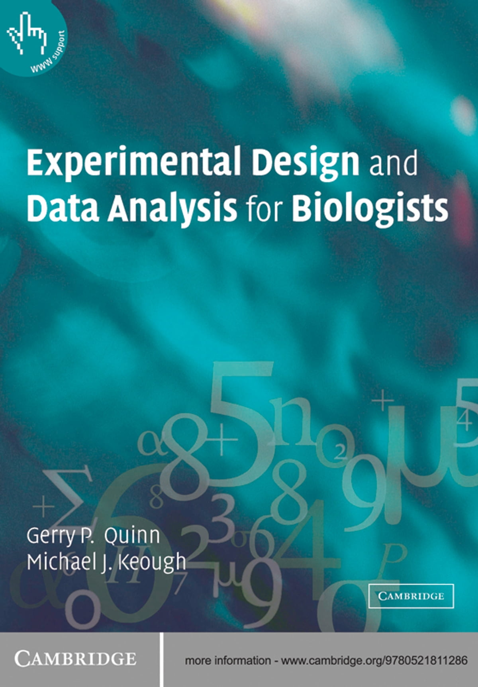

---
format:
  revealjs:
    highlight-style: github
    incremental: false
    theme: FANR6750.scss
    reference-location: document
---

```{r setup-lecture00, echo=FALSE, include=FALSE}

options(htmltools.dir.version = FALSE)

#library(gganimate)
source(here::here("R/zzz.R"))
```

## LECTURE 0: course overview {.theme-title .center}

::: footer
FANR 6750  
Fall 2026
:::


## Logistics

<br/>

**Lecture**: Monday, Wednesday, Friday 1:15-2:10, 1-304\
**Lab**: Monday **or** Tuesday 2:55-5:35, 4-419\
**Credits**: 3

## Instructors {.smaller}

::: columns
::: {.column width="50%"}
Dr. Clark Rushing\
[clark.rushing\@uga.edu](clark.rushing@uga.edu)\
**Office**: 3-409\
**Office hours**: M 1:00-2:30
:::

::: {.column width="50%"}
**TAs**

Alan Bond (M)  
[alan.bond1\@uga.edu](alan.bond1@uga.edu)  
**Office**: 1-102  
**Office hours**: Th 10:00am-12:00pm  

Emily Card (Tu)  
[ec76834@uga.edu](ec76834@uga.edu)  
**Office**: 3-402  
**Office hours**: W 11:00am-1:00pm  

Hannah Wright (F)  
[Hannah.Wright1@uga.edu](Hannah.Wright1@uga.edu)  
**Office**: 3-402  
**Office hours**:  Tu 9:30-11:30 or by appointment

:::
:::

## Course schedule and materials {.smaller}

<br/>

Lectures and labs: [rushinglab.github.io/FANR6750](https://rushinglab.github.io/FANR6750)[^1]

[^1]: Bookmark this page!

<br/>

::: columns
::: {.column width="60%"}
**Primary texts** (not required)

Fieberg, J. (2022). *Statistics for Ecologists - A Frequentist and Bayesian Treatment of Modern Regression Models*. [An open-source online textbook.](https://fw8051statistics4ecologists.netlify.app/)

Quinn, G.P. & Keough, M.J. 2002. *Experimental Design and Data Analysis for Biologists*. Cambridge University Press.
:::

::: {.column width="40%"}
{height="300"}
:::
:::

## Lecture slides

All slides are shared as HTML presentations via the course website. 

See [these instructions](https://quarto.org/docs/presentations/revealjs/presenting.html) for details about: 

- Navigating

- Footnotes (hover and end)

- Presentation notes

- Printing

## Labs {.smaller}

**Meet weekly**

-   You should have registered for one and only one lab section

-   Always attend your assigned lab section unless both TA's have provided prior approval to attend the other section

**Taught in R**

-   No prior experience required

-   But those without prior experience may need to spend time learning outside of class

-   You can use your own laptop but make sure you have R and RStudio installed prior the first lab [^2]


[^2]: See [here](https://rushinglab.github.io/FANR6750/articles/syllabus.html#course-resources-1) for instructions

## Lab assignments {.smaller}

::: {.incremental}

-   8 throughout semester

-   Meant to help with
    -   Understanding lecture/lab concepts
    -   Implementing statistical procedures in R
    -   Interpreting and presenting results

-   Worth 10 points each
    -   Grade based on turning in **complete** assignment **on time**
    -   Answer keys will be posted after all assignments have been submitted

:::

## Grading {.smaller}

200 points total 

. . . 

-   3 lecture exams, 40 points (20%) each

    -   In-class format using eLC/Lockdown Browser [^3]
    -   Primarily focused on concepts, not coding
    -   Pool of 8-10 potential questions provided in advance
    -   Exam consists of 2 questions chosen by me, 2 questions chosen by student
    -   Not (explicitly) cumulative
    -   See schedule for approximate dates (subject to change)

[^3]: Remote students must take exams during class period in an approved setting

. . .

-   8 lab assignments, 10 points (5%) each

## Note on ai {.smaller}

AI tools (e.g., ChatGPT) have advanced very rapidly in a very short time

. . . 

- AI can increasingly help answer questions about statistical concepts, coding, etc.

. . . 

AI = resource (similar to Google, Cross Validated, etc.)

-   AI can help you perform statistical analyses but **it cannot replace your own statistical knowledge**

. . . 

My goal is not to fight AI, but instead focus on responsible and appropriate use

-   Students may use AI to assist with lab assignments but must acknowledge, document, and assess all AI use

-   Students may use AI to assist with exam preparation but must complete exams without the use of AI

-   Unacknowledged use of AI will be considered a violation of course policy. Suspected violations will be referred to the Office of Academic Honesty

## Note on ai {.smaller}

Later in the semester, we will have a class discussion on the role of AI in research/statistical analysis

. . . 

In preparation for that discussion, I highly recommend reading [Bull\$&!t Machines](https://thebullshitmachines.com/table-of-contents/index.html), a short, self-paced course on the LLM

```{r, echo = FALSE, eval = FALSE}

```

## Remote students {.smaller}

Although we do our best to make instruction and materials accessible to remote students, *this is not officially a hybrid class*. That has several implications

-   Teaching to in-person and remote students is hard, especially labs. Technology problems are inevitable

-   Remote students should be prepared to spend extra effort engaging with course materials

-   Remote students must arrange to take exams with a proctor present and exam arrangements must be approved by the instructor prior to the exam

-   MAKE SURE YOU HAVE ACCESS TO THE PRIMARY eLC PAGE!

. . . 

**A note to in-person students:**

In my experience, lab and lecture attendance are strong predictors of performance. Although zoom links can be used for brief or unanticipated absences, students based in Athens should attend classes in person

## Course objectives {.smaller}

<br/>

. . . 

**To understand**:

. . . 

1) The logical structure of experiments, including the design of manipulative and observational experiments
<br/>

. . . 

2) The logic of statistical inference, including causation, from manipulative and observational experiments
<br/>

. . . 

3) The analysis of such experiments, focusing on linear models
<br/>

. . . 

4) The use and interpretation of models in ecological studies
<br/>


## Basic structure {.smaller}

:::{.incremental}

1)  Foundational concepts for statistical inference
<br/>

2)  Linear model basics
<br/>

3)  Null hypothesis significance testing
<br/>

4) Experimental design and causal inference
<br/>

5)  Linear model variations for experiments (t-tests, ANOVA, ANCOVA)
<br/>

6)  Generalized linear models and model selection
:::

## Pre- and post-course assessment {.smaller}

Two short quizzes used to assess collective learning outcomes

-   Posted under `Quizzes` on eLC

-   Require Lockdown Browser extension

-   Pre-assessment available until 8/24/2026

. . .

The assessments do **not** count towards your grade, but students who complete them will receive extra credit on their final grade

-   2 points for completing pre-assessment

-   2 points for completing post-assessment

-   1 points for completing both assessments (5 points total)

## Looking ahead

<br/>

[Next time]{.highlight}: Basic Concepts in Statistics

<br/>

[Reading]{.highlight}: [Quinn chp. 1](https://www2.ib.unicamp.br/profs/fsantos/apostilas/Quinn%20&%20Keough.pdf#page=21.08)
