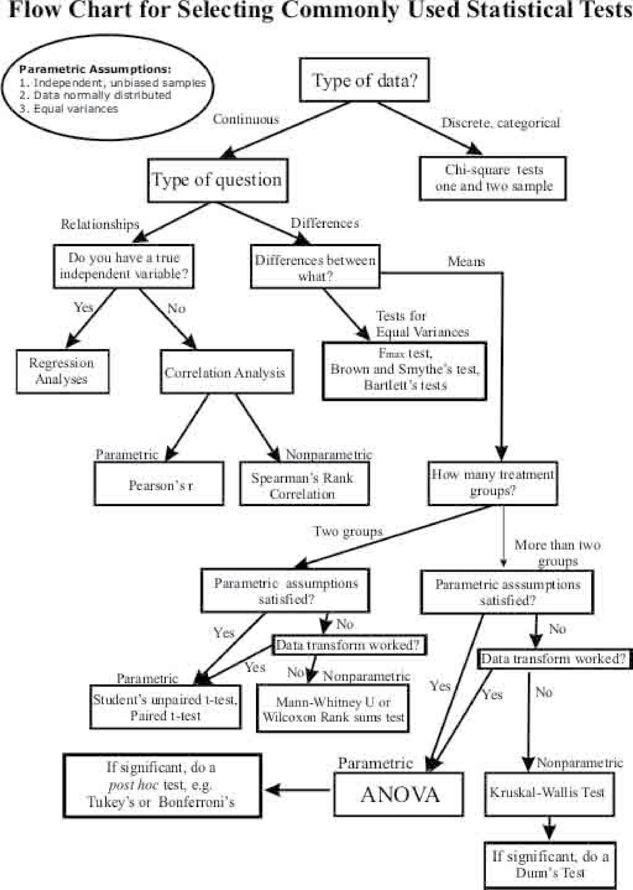

---
format:
  revealjs:
    highlight-style: github
    incremental: false
    theme: FANR6750.scss
    reference-location: document
    html-math-method: mathjax
knitr:
  opts_chunk:
    dev: png
    dev.args: { bg: "transparent" }
---

```{r setup}
#| echo: false
#| include: false
options(htmltools.dir.version = FALSE)
knitr::opts_chunk$set(echo = FALSE, fig.align = 'center', warning = FALSE,
                      message = FALSE, fig.retina = 2)
source(here::here("R/zzz.R"))
```

## LECTURE 2: Introduction to linear models {.theme-title .center}

::: footer
FANR 6750  
Fall 2026
:::

## Outline {.theme-inverse}

<br/>

### 1) Basic structure of a linear model

<br/>

::: {.fragment}
### 2) Parameter interpretation

<br/>
:::

::: {.fragment}
### 3) Assumptions
:::

## {.theme-inverse}

### Statistics = Information + Uncertainty

<br/>

::: {.fragment}

In the last lecture, we learned that statistics is what allows us to make inferences about a population in the face of uncertainty

:::

<br/>

::: {.fragment}
Statistical inference requires *models*
:::

## What is a model?


## What is a model? {.smaller}

> An abstraction of reality used to describe the relationship between two or more variables

<br/>

::: {.fragment}
Many types (conceptual, graphical, mathematical)

<br/>
:::

::: {.fragment}
In this class, we will deal with *statistical* models^[Though graphical models will play an important role later in the semester]
:::

:::{.incremental}
- Mathematical representation of our hypothesis

- Explicitly measure and account for uncertainty

- By necessity, models will be simplifications of reality ("all models are wrong...")

- Do not have to be complex
:::

## But i don't want to be a modeler! {.smaller}

```{r out.width="60%"}

```

:::{.incremental}
- Inference [requires]{.highlight} models

- Models link [observations]{.highlight} to [processes]{.highlght}

- Models are tools that allow us understand processes that we [cannot directly observe]{.highlght} based on quantities that we [can]{.highlight} observe
:::

## A simple example {.smaller}

Suppose we are interested in the hypothesis that water availability limits acorn production by oak trees

- [Prediction]{.highlight}: Acorn production increases following years with higher rainfall

::: {.fragment}
```{r}
#| fig-width: 6
#| fig-height: 4
x <- seq(from = 0, to = 200, by = 0.1)
x2 <- runif(n = 50, 0, 200)
line_df <- data.frame(x = x,
                      y = 50 + 2 * x)
samp_df <- data.frame(x = x2, y = rnorm(n = 25, 50 + 2 * x2, 50))
ggplot(line_df, aes(x = x, y = y)) +
  geom_point(data = samp_df, aes(x = x, y = y), color = "#D47500", alpha = 0.75) +
  scale_x_continuous("Rainfall (mm)") +
  scale_y_continuous("Number of acorns")
```
:::

## A simple model {.smaller}

<br/>

$$\LARGE y = a + bx$$

::: {.fragment}
```{r}
#| fig-width: 5
#| fig-height: 2.5
ggplot(line_df, aes(x = x, y = y)) +
  geom_path(color = "#446E9B")
```
:::

::: {.fragment}
It may not be obvious, but this is essentially the only model we will use this semester^[With some minor variations, mainly in $x$]
:::

## A simple model {.smaller}

<br/>

$$\LARGE y = a + bx$$

```{r}
#| fig-width: 5
#| fig-height: 2.5
ggplot(line_df, aes(x = x, y = y)) +
  geom_path(color = "#446E9B")
```

:::{.fragment}
If we want to use this as a *statistical* model, what's missing?
:::

:::{.fragment}
[Stochasticity]{.highlight}
:::


## A simple model {.smaller}

<br/>

$$\LARGE y = a + bx$$

```{r}
#| fig-width: 5
#| fig-height: 2.5
ggplot(line_df, aes(x = x, y = y)) +
  geom_path(color = "#446E9B") +
  geom_point(data = samp_df, aes(x = x, y = y), color = "#D47500",
             size = 1, alpha = 0.75) +
  scale_x_continuous("Rainfall (mm)") +
  scale_y_continuous("Acorns")
```

If we want to use this as a statistical model, what's missing?

[Stochasticity]{.highlight}

## The linear model {.theme-inverse .center}

## Statistics cookbook

{height=50%, fig-align="center"}

## The linear model

<br/>

$$ response = deterministic\; part+stochastic\; part$$

::: {.fragment}
$$\underbrace{\large E[y_i] = \beta_0 + \beta_1 \times x_i}_{Deterministic}$$
:::

::: {.fragment}
$$\underbrace{\large y_i \sim normal(E[y_i], \sigma)}_{Stochastic}$$
:::

## The linear model {.smaller}

Sometimes you will see linear models written as:

$$\Large y_i = \beta_0 + \beta_1  x_i + \epsilon_i$$

$$\Large \epsilon_i \sim normal(0, \sigma)$$

with the $\large \epsilon_i$ terms referred to as *residuals* or *residual error*

- Mathematically, the two formulations are identical

- We will use both formulations

## A note on notation {.theme-inverse .smaller}

Throughout the semester, we will try to be consistent with mathematical notation, e.g.

- $y$ = response/dependent variable
- $x$ = predictor/independent variable
- $\mu$ = population mean
- $\sigma$ = population standard deviation
- $\beta$ = model parameter (i.e., intercept/slope)

::: {.fragment}
To the extent possible, these follow conventions used in many textbooks/papers (but there is a lot of variation between authors)
:::

::: {.fragment}
Remember that these are just *symbols* - you could replace them with other symbols (e.g., emoji) and it would not change their interpretation!
:::

## Parameter interpretation {.smaller}

$\large \beta_0$ = intercept

- The *expected* value of the response variable, $\large E[y_i]$, when all predictors $=0$

$\large \beta_n$ = slope

- The expected change in the response variable for a one unit change in the associated predictor variable $\large x_n$

::: {.fragment}
Mathematically, the interpretation of the intercept and slope(s) is always the same
:::

::: {.fragment}
Ecologically, the interpretation will depend on:

- the structure of the predictor variables (continuous vs. categorical)
- the units of the predictor variables (e.g., scaled vs unscaled)
- the inclusion of interaction terms
:::

::: {.fragment}
We will discuss each of these scenarios in detail as the semester progresses
:::


## The linear model {.smaller}

A "simple" example

$$\underbrace{\large E[y_i] = -2 + 0.5 \times x_i}_{Deterministic}$$

::: {.fragment}
$$\underbrace{\large y_i \sim normal(E[y_i], \sigma=0.25)}_{Stochastic}$$
:::

::: {.fragment}
```{r}
#| fig-width: 5
#| fig-height: 3
x <- rnorm(100)
y <- -2 + 0.5 * x + rnorm(100, 0, 0.25)
mu <- -2 + 0.5 * x
resid <- y - mu
df <- data.frame(x = x, y = y, mu = mu, Residuals = resid)

ggplot(df, aes(x, y)) +
  geom_abline(slope = 0.5, intercept = -2, color = "#446E9B", size = 1.5) +
  scale_y_continuous("y") +
  geom_point(color = "#D47500", alpha = 0.75, size = 1)
```
:::

## The linear model {.smaller}

A more complex model

$$\large y_i = \beta_0 + \beta_1x_{i1} + \beta_2x_{i2} + ... + \beta_px_{ip} + \epsilon_i$$

:::{.incremental}
- Each $\beta$ coefficient is the effect of a specific predictor variables $x$
- Predictor variables may be continuous, binary, factors, or a combination
- We will cover more complex models (and interpretation) later
:::

## Is this a linear model?

$$\large y = 20 + 0.5x - 0.3x^2$$

```{r}
#| fig-width: 5.5
#| fig-height: 3.5
x <- seq(from = 0, to = 10, 0.1)
lm2 <- data.frame(x = x,
                  y = 20 + 0.5 * x - 0.3 * x^2)

ggplot(lm2, aes(x = x, y = y)) +
  geom_line()
```

## Residuals {.smaller}
 
One concept we will talk about a lot is *residuals*, i.e., $\epsilon_i$

::: {.fragment}
- Residuals are the difference between the observed values $y_i$ and the predicted values $E[y_i]$ — how much variation in $y$ is explained by $x$?

```{r}
#| fig-width: 6
#| fig-height: 4
ggplot(df, aes(x, y)) +
  geom_segment(aes(x = x, xend = x, y = mu, yend = y), color = "#3CB521", size = 1) +
  geom_abline(slope = 0.5, intercept = -2, color = "#446E9B", size = 1.5) +
  scale_y_continuous("y") +
  geom_point(color = "#D47500", alpha = 0.9)
```
:::

## Residuals {.smaller}

One concept we will talk about a lot is *residuals*, i.e., $\epsilon_i$

- Residuals are the difference between the observed values $y_i$ and the predicted values $E[y_i]$ — how much variation in $y$ is explained by $x$?

```{r}
#| fig-width: 5.5
#| fig-height: 3.5
ggplot(df, aes(x, Residuals)) +
  geom_abline(slope = 0, intercept = 0, color = "grey40", linetype = "dashed", size = 1.5) +
  geom_point(color = "#D47500", alpha = 0.75)
```

:::{.incremental}
- Parameters are generally estimated by finding values that minimize residual error (e.g., ordinary least squares)
- Useful for assessing whether data violate model assumptions
:::

## Assumptions {.theme-inverse .center}

## Assumptions {.smaller}

**EVERY** model has assumptions

:::{.incremental}
- Assumptions are necessary to simplify real world to workable model
- If your data violate the assumptions of your model, inferences *may* be invalid
- **Always** know (and test) the assumptions of your model^[You know what happens when you assume...]
:::

## Linear model assumptions {.smaller}

<br/>

$$\Large y_i = \beta_0 + \beta_1 x_i + \epsilon_i$$

$$\Large \epsilon_i \sim normal(0, \sigma)$$

<br/>

:::{.incremental}
1) **Linearity**: The relationship between $x$ and $y$ is linear
2) **Normality**: The residuals are normally distributed^[Note that these assumptions apply to the residuals, not the data!]
3) **Homogeneity**: The residuals have a constant variance at every level of $x$
4) **Independence**: The residuals are independent (i.e., uncorrelated with each other)
:::

## Assumptions

$$\large y_i = \beta_0 + \beta_1x_i + \epsilon_i$$
$$\large \epsilon_i \sim normal(0, \sigma)$$

```{r}
#| fig-width: 8
#| fig-height: 6
x <- runif(100, 0, 60)
ey <- 10 + 1 * x
eps <- rnorm(100, 0, 3)
y <- ey + eps
df_assump <- data.frame(x, y)
lm_fit <- lm(y ~ x, data = df_assump)

k <- 2.5
sigma <- sigma(lm_fit)
ab <- coef(lm_fit); a <- ab[1]; b <- ab[2]

xd <- seq(-k * sigma, k * sigma, length.out = 50)
yd <- dnorm(xd, 0, sigma) / dnorm(0, 0, sigma) * 3

x0 <- 5;  y0 <- a + b * x0
path1 <- data.frame(x = yd + x0, y = xd + y0)
segment1 <- data.frame(x = x0, y = y0 - k*sigma, xend = x0, yend = y0 + k*sigma)
x0 <- 20; y0 <- a + b * x0
path2 <- data.frame(x = yd + x0, y = xd + y0)
segment2 <- data.frame(x = x0, y = y0 - k*sigma, xend = x0, yend = y0 + k*sigma)
x0 <- 35; y0 <- a + b * x0
path3 <- data.frame(x = yd + x0, y = xd + y0)
segment3 <- data.frame(x = x0, y = y0 - k*sigma, xend = x0, yend = y0 + k*sigma)
x0 <- 50; y0 <- a + b * x0
path4 <- data.frame(x = yd + x0, y = xd + y0)
segment4 <- data.frame(x = x0, y = y0 - k*sigma, xend = x0, yend = y0 + k*sigma)

ggplot(df_assump, mapping = aes(x = x, y = y)) +
  geom_point(color = "#446E9B", alpha = 0.5)
```

## Assumptions - linearity

$$\large y_i = \color{#D47500}{\beta_0 + \beta_1x_i} + \epsilon_i$$
$$\large \epsilon_i \sim normal(0, \sigma)$$

```{r}
#| fig-width: 8
#| fig-height: 6
ggplot(df_assump, mapping = aes(x = x, y = y)) +
  geom_point(color = "#446E9B", alpha = 0.5) +
  geom_smooth(method = 'lm', se = FALSE, color = "#D47500", alpha = 0.5)
```

## Assumptions - normality

$$\large y_i = \color{#D47500}{\beta_0 + \beta_1x_i} + \epsilon_i$$
$$\large \epsilon_i \sim \color{#3CB521}{normal}(0, \sigma)$$

```{r}
#| fig-width: 8
#| fig-height: 6
ggplot(df_assump, mapping = aes(x = x, y = y)) +
  geom_point(color = "#446E9B", alpha = 0.5) +
  geom_smooth(method = 'lm', se = FALSE, color = "#D47500", alpha = 0.5) +
  geom_path(aes(x, y), data = path1, linewidth = 1, color = "#3CB521") +
  geom_path(aes(x, y), data = path2, linewidth = 1, color = "#3CB521") +
  geom_path(aes(x, y), data = path3, linewidth = 1, color = "#3CB521") +
  geom_path(aes(x, y), data = path4, linewidth = 1, color = "#3CB521")
```

## Assumptions - homogeneity

$$\large y_i = \color{#D47500}{\beta_0 + \beta_1x_i} + \epsilon_i$$
$$\large \epsilon_i \sim \color{#3CB521}{normal}(0, \color{#CD0200}\sigma)$$

```{r}
#| fig-width: 8
#| fig-height: 6
ggplot(df_assump, mapping = aes(x = x, y = y)) +
  geom_point(color = "#446E9B", alpha = 0.5) +
  geom_smooth(method = 'lm', se = FALSE, color = "#D47500", alpha = 0.5) +
  geom_path(aes(x, y), data = path1, linewidth = 1, color = "#3CB521") +
  geom_path(aes(x, y), data = path2, linewidth = 1, color = "#3CB521") +
  geom_path(aes(x, y), data = path3, linewidth = 1, color = "#3CB521") +
  geom_path(aes(x, y), data = path4, linewidth = 1, color = "#3CB521") +
  geom_segment(aes(x = x, y = y, xend = xend, yend = yend), data = segment1,
               linewidth = 0.6, color = "#CD0200") +
  geom_segment(aes(x = x, y = y, xend = xend, yend = yend), data = segment2,
               linewidth = 0.6, color = "#CD0200") +
  geom_segment(aes(x = x, y = y, xend = xend, yend = yend), data = segment3,
               linewidth = 0.6, color = "#CD0200") +
  geom_segment(aes(x = x, y = y, xend = xend, yend = yend), data = segment4,
               linewidth = 0.6, color = "#CD0200")
```

## Assumptions - normality {.smaller}

Remember that the normality assumption applies to the *residuals* not the data.

::: {.fragment}
In the data below, the histogram of the response variable *y* shows that the data is clearly not normally distributed

```{r}
#| fig-width: 9
#| fig-height: 4
set.seed(97342)
xn <- c(rnorm(60, 7, 3), runif(40, 15, 60))
eyn <- -3 + 1.2 * xn
epsn <- rnorm(length(xn), 0, 4)
yn <- eyn + epsn
fm1 <- lm(yn ~ xn)

df_norm <- data.frame(y = yn, ey = eyn, x = xn, r = resid(fm1))

plot_y <- ggplot(df_norm, aes(x = y)) +
  geom_histogram() +
  scale_y_continuous("") +
  scale_x_continuous("y")
plot_xy1 <- ggplot(df_norm, aes(x = x, y = y)) +
  stat_smooth(method = "lm", color = "red", se = FALSE) +
  geom_point(alpha = 0.5, size = 1)
plot_xy2 <- ggplot(df_norm, aes(x = x, y = y)) +
  stat_smooth(method = "lm", color = "red", se = FALSE) +
  geom_segment(aes(x = x, xend = x, y = ey, yend = y), color = "#3CB521", size = 1) +
  geom_point(alpha = 0.5, size = 1)
plot_r <- ggplot(df_norm, aes(x = r)) +
  geom_histogram() +
  scale_y_continuous("") +
  scale_x_continuous("residuals")

cowplot::plot_grid(plot_xy1, plot_y, nrow = 1, ncol = 3)
```
:::

## Assumptions - normality {.smaller}

Remember that the normality assumption applies to the *residuals* not the data.

In the data below, the histogram of the response variable *y* shows that the data is clearly not normally distributed

But a histogram of the residuals (green lines) shows that they are normal (or at least close)

```{r}
#| fig-width: 9
#| fig-height: 4
cowplot::plot_grid(plot_xy2, plot_y, plot_r, nrow = 1, ncol = 3)
```

## Linear models {.smaller}

Very flexible

:::{.incremental}
- Predictor(s) can take different forms (binary, continuous, factor)
- Can contain many predictors
- Can model non-linear relationships
:::

::: {.fragment}
Link different "tests" (e.g., t-tests, ANOVA, ANCOVA, linear regression)
:::

::: {.fragment}
Can be used for different statistical goals

- Estimating unknown parameters
- Testing hypotheses
- Describing stochastic systems
- Making predictions that account for uncertainty
:::

## Statistical inference {.smaller}

Linear models allow us to quantify relationships between variables

::: {.fragment}
Generally, models are fit to **samples**

- The intercept and slope values correspond to the *observed* response and predictor values

- If we repeated our study, the sampled values would change and so would the intercept/slope values
:::

::: {.fragment}
We're generally interested in the **population**, not the sample

- The intercept and slope values fitted to a particular sample are considered *estimates* of the true population values
:::

::: {.fragment}
Inference about populations requires quantifying how well our estimated values represent the true population values (which we can never know)

- This will be the topic of the next lecture (and a theme we will revisit throughout the semester)
:::

## Looking ahead

<br/>

[Next time]{.highlight}: Principles of statistical inference

<br/>

[Reading]{.highlight}: [Feiberg chp. 1.6-1.8](https://statistics4ecologists-v3.netlify.app/01-linearregression#sec-sampdist)
