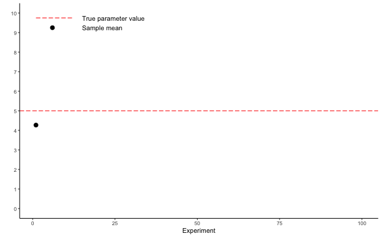

---
format:
  revealjs:
    highlight-style: github
    incremental: false
    theme: FANR6750.scss
    reference-location: document
knitr:
  opts_chunk:
    dev: png
    dev.args: { bg: "transparent" }
from: markdown+emoji
---

```{r setup}
#| echo: false
#| include: false
options(htmltools.dir.version = FALSE)
knitr::opts_chunk$set(echo = FALSE, fig.align = 'center', warning = FALSE,
                      message = FALSE, fig.retina = 2)
source(here::here("R/zzz.R"))
```

## LECTURE 3: principles of statistical inference {.theme-title .center}

::: footer
FANR 6750  
Fall 2026
:::

## Outline {.theme-inverse}

<br/>

### 1) Uncertainty in statistical models

<br/>  

::: {.fragment}
### 2) Sampling distributions

<br/> 
:::
::: {.fragment}
### 3) Standard error

<br/> 
:::

::: {.fragment}
### 4) Confidence intervals

<br/> 
:::

## {.theme-inverse .smaller}

$$\Large Statistics = Information + Uncertainty$$

</br> 

In the last lecture, we learned that models allow us to quantify relationships between variables based on **samples**

</br>

:::{.fragment}
We also learned that sampling = uncertainty

- Parameter estimates from samples will never exactly equal population parameters

</br>
:::

:::{.fragment}
Inference about populations requires quantifying the magnitude of this uncertainty

</br>
:::

:::{.fragment}
But how can we measure how far our estimates are from the population parameters if we don't know the population parameters? 
:::

## Parameters vs statistics {.smaller}

:::: {.columns}

::: {.fragment .column width="50%"}
[Parameters]{.highlight}

- Attributes of the population  
  + Mean ( $\mu$ )  
  + Variance ( $\sigma^2$ )  
  + Standard deviation ( $\sigma$ )  

:::{.fragment}
- Usually unknown
- Parameters are the quantities of interest
- Generally denoted using Greek letters
:::

:::
:::{.fragment .column width="50%"}
[Statistics]{.highlight}

- Attributes of the sample  
  + Mean ( $\bar{y}$ or $\hat{\mu}$ )  
  + Variance ( $s^2$ or $\hat{\sigma}^2$ )  
  + Standard deviation ( $s$ or $\hat{\sigma}$ )  

:::{.fragment}
- English alphabet generally used to denote summary statistics of a sample^[The mean of sample is often denoted as $\bar{y}$]

- Often treated as estimates of parameters^["hat" notation (e.g., $\hat{\mu}$) is generally used to indicate that the sample statistics is being treated as an *estimate* of a parameter]
:::

:::

::::

## Sampling error {.smaller}

Question: What is the probability that $\bar{y} = \mu$?

:::{.fragment}
- Answer: 0
:::

:::{.fragment}
- Fact: The sample mean will never equal the population mean
:::

:::{.fragment}
- The difference between $\bar{y}$ and $\mu$ is **sampling error**
:::

:::{.fragment}
- Sampling error can be reduced but it cannot be eliminated
:::

:::{.fragment}
Problem: If we don't know $\mu$, how do we know how far our estimate is from the true value?
:::

:::{.fragment}
- Answer: We don't (for any specific sample)
:::

:::{.fragment}
- BUT...we do know how far, on average, a sample of size $n$ will be from the true value
:::

## The sampling distribution {.theme-inverse .center}


## A population

<br/>

```{r pop1}
#| fig-width: 9
#| fig-height: 5.6
#| 
set.seed(42231)
x <- seq(from = 60, to = 80, length.out = 100)

pop_df <- data.frame(x = x,
                     y = c(dnorm(x, 70, 2)))

samp_df <- data.frame(y = c(rnorm(25, 70, 2)),
                      Sample = "1")
mean_df <- data.frame(x = mean(samp_df$y))
ggplot() +
  geom_path(data = pop_df, aes(x = x, y = y), size = 1, color = "#446E9B") +
  geom_vline(xintercept = 70, size = 1, color = "#446E9B") +
  scale_x_continuous("") +
  scale_y_continuous("") +
  labs()
```

## A single sample (n = 25)

<br/>

```{r samp1}
#| fig-width: 9
#| fig-height: 5.6
#| 
ggplot() +
  geom_path(data = pop_df, aes(x = x, y = y), size = 1, color = "#446E9B") +
  geom_vline(xintercept = 70, size = 1, color = "#446E9B", linetype = "longdash") +
  geom_rug(data = samp_df, aes(x = y), sides = "b", color = "#D47500") +
  geom_vline(data = mean_df, aes(xintercept = x), size = 0.6, 
             color = "#D47500") +
  scale_x_continuous("") +
  scale_y_continuous("") +
  labs()
```

## A single sample (n = 25)

<br/>

```{r sampling}
#| fig-width: 9
#| fig-height: 5.6
set.seed(623451)

samp <- data.frame(Experiment = 1:100,
                   time = 1:100,
                   Estimate = numeric(length = 100),
                   SE = numeric(length = 100))
  samp$Estimate[1] <- mean(samp_df$y)
  samp$SD[1] <- sd(samp_df$y)
  samp$SE[1] <- sd(samp_df$y)/sqrt(25)
  
for(i in 2:100){
  x <- rnorm(25, 70, 2)
  samp$Estimate[i] = mean(x)
  samp$SD[i] = sd(x)
  samp$SE[i] = sd(x)/sqrt(25)
}

p <- ggplot(samp[samp$Experiment==1,], aes(x = Experiment, y = Estimate)) +
  geom_point() +
  geom_hline(yintercept = 70,  color = "#446E9B", linetype = "longdash") +
  scale_y_continuous(name = "", limits = c(66, 73), breaks = seq(from = 66, to = 73)) +
  scale_x_continuous(limits = c(0, 100)) +
  theme_classic() +
  geom_segment(aes(y = 72.75, yend = 72.75, x = 1, xend = 12), 
                color = "#446E9B", linetype = "longdash") +
  annotate(x = 15, y = 72.75, label = "True parameter value", geom = "text", hjust = 0) +
  geom_point(aes(y = 72.25, x = 6)) +
  annotate(x = 15, y = 72.25, label = "Sample mean", geom = "text", hjust = 0) 
p
```


## Standard deviation

<br/>

```{r sampling_sd}
#| fig-width: 9
#| fig-height: 5.6
p + geom_errorbar(data = samp[samp$Experiment==1,], aes(x = Experiment, ymin = Estimate - SD, ymax = Estimate + SD), width = 0)
```

:::{.fragment}
This error bar is the standard deviation [of our sample]{.highlight}!  
:::

## Standard deviation

But remember, what we really want to know is, how far is the sample mean from the true parameter value?

:::{.fragment}

```{r sample_se}
#| fig-width: 9
#| fig-height: 5
p + geom_segment(aes(x = 1, xend = 1, y = 70, yend = Estimate), color = "red")
```
:::


## The sampling distribution

Imagine we could repeat our experiment many, many times

```{r sample_gif}


```

## the sampling distribution

The collection of sample means is referred to as the **sampling distribution**  

```{r sampling_dist}
#| fig-width: 9
#| fig-height: 5.6
ggplot(samp, aes(x = Experiment, y = Estimate)) +
  geom_point() +
  geom_hline(yintercept = 70, color = "#446E9B",  linetype = "longdash") +
  scale_y_continuous(name = "", limits = c(68, 73), breaks = seq(from = 68, to = 73)) +
  scale_x_continuous(limits = c(0, 100)) +
  theme_classic() +
  geom_segment(aes(y = 72.75, yend = 72.75, x = 1, xend = 12), 
               color = "#446E9B", linetype = "longdash") +
  annotate(x = 15, y = 72.75, label = "True parameter value", geom = "text", hjust = 0) +
  geom_point(aes(y = 72.25, x = 6)) +
  annotate(x = 15, y = 72.25, label = "Sample mean", geom = "text", hjust = 0) 
```

## The sampling distribution

The collection of sample means is referred to as the **sampling distribution**  

```{r sampling_dist2}
#| fig-width: 9
#| fig-height: 5.6

wing_df <- data.frame(z = seq(from = 63, to = 77, by = 0.1),
                      pr_z = dnorm(x = seq(from = 63, to = 77, by = 0.1), 70, 2))

ggplot() + 
  geom_histogram(data = samp, aes(x = Estimate, y = ..density..), 
                 fill = "#999999", alpha = 0.75, color = "#999999", bins = 60) +
  geom_rug(data = samp, aes(x = Estimate), color = "#D47500") +
  geom_path(data = wing_df, aes(x = z, y = pr_z), color = "#446E9B") +
  scale_y_continuous("Density") +
  annotate("text", x = 65, y = 0.25, label = "population", color = "#446E9B") +
  geom_segment(color = "#446E9B", aes(x = 65.25, y = 0.23, xend = 68, yend = 0.125),
               arrow = arrow(length = unit(0.25, "cm"))) +
  # geom_segment(aes(x = 15.25, y = 0.0215, xend = 45, yend = 0.015),
  #              arrow = arrow(length = unit(0.25, "cm"))) +
  annotate("text", x = 73.65, y = 0.28, label = "sample mean frequencies") +
  geom_segment(aes(x = 72, y = 0.27, xend = 70.9, yend = 0.23),
               arrow = arrow(length = unit(0.25, "cm"))) +
  annotate("text", x = 75, y = 0.05, label = "sample means", color = "#D47500") +
  geom_segment(aes(x = 74, y = 0.05, xend = 71.25, yend = -0.02),
               arrow = arrow(length = unit(0.25, "cm")), color = "#D47500") +
  # geom_segment(aes(x = 26.5, y = 0.049, xend = 53, yend = 0.041),
  #              arrow = arrow(length = unit(0.25, "cm"))) +
  scale_x_continuous("Sample mean", expand = c(0, 0))
```

## The sampling distribution

The standard deviation *of the sampling distribution* measures, on average, how far each sample mean from the true population value

```{r sampling_se}
#| fig-width: 9
#| fig-height: 5.6
ggplot(samp, aes(x = Experiment, y = Estimate)) +
  geom_segment(aes(x = Experiment, xend = Experiment, y = 70, yend = Estimate), color = "blue") +
  geom_point() +
  geom_hline(yintercept = 70, color = "red", linetype = "longdash") +
  scale_y_continuous(name = "", limits = c(68, 73), breaks = seq(from = 68, to = 73)) +
  scale_x_continuous(limits = c(0, 100)) +
  theme_classic() +
  geom_segment(aes(y = 72.75, yend = 72.75, x = 1, xend = 12), 
               color = "red", linetype = "longdash") +
  annotate(x = 15, y = 72.75, label = "True parameter value", geom = "text", hjust = 0) +
  geom_point(aes(y = 72.25, x = 6)) +
  annotate(x = 15, y = 72.25, label = "Sample mean", geom = "text", hjust = 0) 
```


## The sampling distribution

We rarely repeat experiments

<br/>

:::{.fragment}
But we can estimate the standard deviation of the sampling distribution from a single sample!
<br/>
:::

:::{.fragment}
How? The **central limit theorem**!
:::


## Central limit theorem {.theme-inverse .smaller}

> For a population with mean $\mu$ and standard deviation $\sigma$, the sampling distribution will be (approximately) normally distributed with mean $\mu_X = \mu$ and standard deviation $\sigma_X = \sigma/\sqrt{n}$. 


```{r clt}
#| fig-width: 9
#| fig-height: 5.6
samp2 <- data.frame(Experiment = 1:1000,
                   time = 1:1000,
                   Estimate = numeric(length = 1000),
                   SE = numeric(length = 1000))

for(i in 1:1000){
  x <- rnorm(30, 70, 2)
  samp2$Estimate[i] = mean(x)
  samp2$SD[i] = sd(x)
  samp2$SE = sd(x)/sqrt(30)
}

ggplot() + 
  geom_histogram(data = samp2, aes(x = Estimate, y = ..density..), 
                 fill = "#999999", alpha = 0.75, color = "#999999", bins = 60) +
  geom_rug(data = samp2, aes(x = Estimate), color = "#D47500") +
  geom_path(data = wing_df, aes(x = z, y = pr_z), color = "#446E9B") +
  geom_vline(xintercept = 70, color = "white") +
  geom_vline(xintercept = mean(samp2$Estimate), linetype = "dashed", color = "white") +
  scale_y_continuous("Density") +
  scale_x_continuous("Sample mean", expand = c(0, 0)) +
  labs(subtitle = "Sampling distribution of 1000 samples (n = 30)") +
  theme(panel.background = element_rect(fill = "#2e2e2e"),
        plot.background = element_rect(color = "#2e2e2e", fill = "#2e2e2e"))
```


## Central limit theorem {.theme-inverse .smaller}

> For a population with mean $\mu$ and standard deviation $\sigma$, the sampling distribution will be (approximately) normally distributed with mean $\mu_X = \mu$ and standard deviation $\sigma_X = \sigma/\sqrt{n}$. 

This might seem academic but it is hugely important

- given sufficient sample size ( $\sim n > 30$ ), we *know* the sampling distribution will be normally distributed without needing to repeat the experiment

- although we never know the true population mean $\mu$, we can estimate how far (on average) our sample mean is likely to be away from it (that's what the standard deviation is!)

- the CLT will hold true regardless of whether the source population is normal! 

- [Demonstration using simulations](http://www.ltcconline.net/greenl/java/Statistics/clt/cltsimulation.html)


## Standard error {.smaller}

The standard deviation of the sampling distribution is called the **standard error of the mean** (or just the standard error)

$$\Large SE =\frac{s}{\sqrt{n}}$$

- Standard error tells us how far (on average) our sample mean is likely to be from the population mean

- It is the key to estimating uncertainty in our estimates

- Smaller is better


## Descriptive vs inferential statistics {.theme-inverse .smaller}

> The sample standard deviation ( $s$ ) is a descriptive statistic  

$$\large s = \sqrt{s^2}$$

- $s$ tells us how far, on average, each observation $y$ is from the sample mean $\bar{y}$


:::{.fragment}
> The standard error (SE) is an inferential statistic  

$$\large SE = \frac{s}{\sqrt{n}}$$

- $SE$ tells us how far, on average, each sample mean $\bar{y}$ is from the population mean $\mu$
:::


## Quick review {.smaller}

1) Sampling is a stochastic process 

- Sample statistics (mean, standard deviation) will vary from sample to sample

:::{.fragment}
2) The sampling distribution is an (imaginary) collection of statistics from repeated samples of the same population

- Assumes that the procedure for generating samples (e.g., sample size) is identical
:::

:::{.fragment}
3) Standard error is the standard deviation of the sampling distribution

- $SE =  s/\sqrt{n}$

- measures how far, on average, sample statistics are from the true population value (smaller is better!)
:::

:::{.fragment}
We will explore these concepts in lab, using `R` to generate and visualize repeated samples, calculate properties of the sampling distribution
:::

## Confidence intervals {.theme-inverse}


## Confidence intervals {.smaller}

Uncertainty is commonly reported using *confidence intervals* 

- this is a concept that seems intuitive but in reality it is commonly misunderstood

> If we calculated a $x$% confidence interval from repeated samples of the population, about $x$% of those confidence intervals would contain the true population mean  

```{r ci, fig.width=8, fig.height=4}
samp <- dplyr::mutate(samp, LCI = Estimate - 1.96 * SE,
                      UCI = Estimate + 1.96 * SE,
                      Coverage = ifelse(LCI <=70 & UCI >= 70, "Yes", "No"))
ggplot(samp, aes(x = Experiment, y = Estimate)) +
  geom_errorbar(aes(ymin = LCI, ymax = UCI, color = Coverage), width = 0) +
  geom_point(aes(color = Coverage)) +
  scale_color_manual(values = c("red", "black")) +
  geom_hline(yintercept = 70, color = "red", linetype = "longdash") +
  scale_y_continuous(name = "", limits = c(68, 73), breaks = seq(from = 68, to = 72)) +
  scale_x_continuous(limits = c(0, 100)) +
  theme_classic() +
  geom_segment(aes(y = 72.75, yend = 72.75, x = 1, xend = 12), 
               color = "red", linetype = "longdash") +
  annotate(x = 15, y = 72.75, label = "True parameter value", geom = "text", hjust = 0) +
  geom_point(aes(y = 72.25, x = 6)) +
  annotate(x = 15, y = 72.25, label = "Sample mean and 95% confidence interval", geom = "text", hjust = 0) 

```


## Calculating confidence intervals {.smaller}


:::{.fragment}
95% of a normal distribution falls between -1.96 and 1.96 standard deviation of the mean^[Can easily be calculated for other percentages using `R`]


```{r fig.width=7, fig.height=3}
ggplot(NULL, aes(c(-3,3))) +
  geom_area(stat = "function", fun = dnorm, fill = "grey80", xlim = c(-3, 3)) +
  geom_area(stat = "function", fun = dnorm, fill = "#446E9B", 
            xlim = c(-1.96, 1.96), alpha = 0.75) +
  scale_x_continuous("", breaks = c(-1.96, 0, 1.96),
                     labels = c(expression(-1.96 * sigma), 
                                expression(mu), 
                                expression(1.96 * sigma))) +
  scale_y_continuous("Density") 
```

:::

:::{.fragment}
Question - if this is the sampling distribution, what is the standard deviation? What is our estimate of the mean?
:::

:::{.fragment}
95% CI = $\large \bar{y} \pm 1.96 \times SE$
:::


## Confidence intervals {.smaller}

What a confidence interval is **NOT**:

- "there is an $x$% probability that the true population parameter is inside this interval" 


:::{.fragment}
The true population value is considered a *fixed* parameter
:::

:::{.fragment}
Before we collect our sample, the ends of the confidence intervals are considered *random variables* (i.e., their value will change each time we collect a sample)

-  Like all random variables, we can describe the long-term (i.e., asymptotic) expectations of confidence intervals if we repeated the experiment many times
:::

:::{.fragment}
After we collect our sample, the confidence interval either *does* or *does not* contain the true population value
:::

## Confidence intervals {.smaller}

::::{.columns}

:::{.fragment .column width="50%"}
Think of confidence intervals like trying to determine where the stake is in a game of horseshoes by looking at where the horseshoes landed 

- The true parameter (i.e., the stake) does not move

- Each horseshoe is the CI based on a single sample (i.e., one throw) 

- Before a horseshoe is thrown, there is some probability it will land around the stake

- After it is thrown, it is either around the stake or not

or...
:::

:::{.fragment .column width="50%"}
```{r dunk, out.height="80%"}
#remotes::install_github("gadenbuie/tiktokrmd")
library(tiktokrmd)
tt_url <- "https://www.tiktok.com/@dunk/video/7218281145279220997"
tt <- tiktok_embed(tt_url)
tt
```

:::

::::


## Confidence intervals {.smaller}

I like to think of confidence intervals as providing a range of values that, based on our sample, are consistent with the population mean (*plausible interval*?)

- If want to be more confident that the CI contains the parameter (e.g., 50% CI vs 95% CI), what happens to the size of the interval?

:::{.fragment}
The confidence interval we calculate from our sample **will not** include the true population mean 1 - $x$% of the time

```{r ci2, fig.width=4.5, fig.height=2}
ggplot(samp, aes(x = Experiment, y = Estimate)) +
  geom_errorbar(aes(ymin = LCI, ymax = UCI, color = Coverage), width = 0) +
  geom_point(aes(color = Coverage)) +
  scale_color_manual(values = c("red", "black")) +
  geom_hline(yintercept = 70, color = "red", linetype = "longdash") +
  scale_y_continuous(name = "", limits = c(68, 73), breaks = seq(from = 68, to = 72)) +
  scale_x_continuous(limits = c(0, 100)) +
  theme_classic() +
  geom_segment(aes(y = 72.75, yend = 72.75, x = 1, xend = 12), 
               color = "red", linetype = "longdash") +
  annotate(x = 15, y = 72.75, label = "True parameter value", geom = "text", hjust = 0) +
  geom_point(aes(y = 72.25, x = 6)) +
  annotate(x = 15, y = 72.25, label = "Sample mean and 95% confidence interval", geom = "text", hjust = 0) 

```

Of course, with our real data, we have no way of knowing if our sample is one of the black points on this graph :grinning: or one of the red dots :sob:
:::

## For thought

If our goal is generally to decrease uncertainty in parameter estimates:

- What factors determine the magnitude of our uncertainty estimates (SE or confidence intervals)?

<br/>

- What can we, as researchers, control when we design experiments to minimize uncertainty? What can we not control?


## Looking ahead

<br/>

[Next time]{.highlight}: Linear models part 1: categorical predictor w/ 2 levels

<br/>

[Reading]{.highlight}: [Fieberg chp. 3.6](https://statistics4ecologists-v3.netlify.app/03-multipleregression#categorical-predictors)
