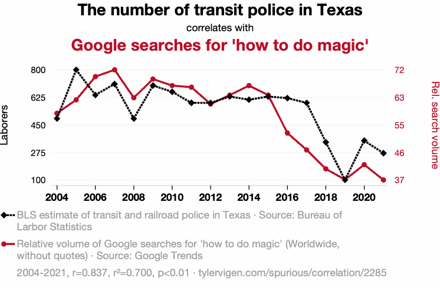
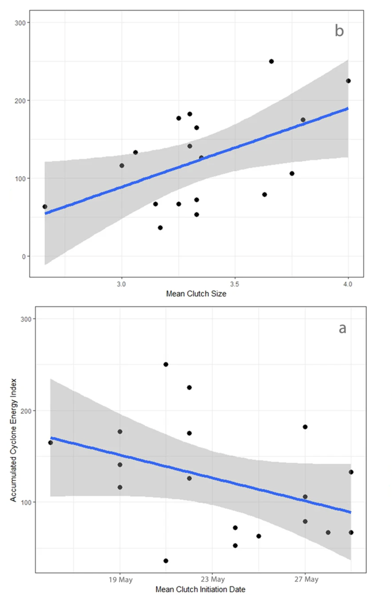

---
format:
  revealjs:
    highlight-style: github
    incremental: false
    theme: FANR6750.scss
    reference-location: document
knitr:
  opts_chunk:
    dev: png
    dev.args: { bg: "transparent" }
from: markdown+emoji
---

```{r setup}
#| echo: false
#| include: false
options(htmltools.dir.version = FALSE)
knitr::opts_chunk$set(echo = FALSE, fig.align = 'center', warning = FALSE,
                      message = FALSE, fig.retina = 2)
source(here::here("R/zzz.R"))
```

## LECTURE 7: principles of causal inference {.theme-title .center}

::: footer
FANR 6750  
Fall 2026
:::

## Outline {.theme-inverse}


1) Motivating examples


::: {.fragment}
2) Correlation vs Causation

:::
::: {.fragment}
3) Confounding

:::

::: {.fragment}
4) Causal assumptions

:::

::: {.fragment}
5) Science Before Statistics

:::

## Statistical associations {.smaller}

Statistical models measure the strength of associations between variables

- When $X$ changes, $Y$ tends to change too

```{r}
#| fig-width: 6
#| fig-height: 4
set.seed(10392)
xy <- MASS::mvrnorm(n = 15, mu = c(5, 10), 
                    Sigma = matrix(c(10,3,3,2),2,2))
xy_df <- data.frame(X = xy[,1], Y = xy[,2])
ggplot(xy_df, aes(x = X, y = Y)) +
  geom_point() +
  stat_smooth(method = "lm", se = F)
```


## Statistical associations {.smaller}

{width="33%" fig-align="center" fig-alt="Graph showing correlation between number of transit police in Texas and google searches for 'how to do magic'."}


Is there a statistical association between transit police and google searches? Do transit police *cause* google searches to increase?

## Statistical associations {.smaller}


:::: {.columns}

::: {.column width="50%"}

{width="90%" fig-align="center" fig-alt="News headline that says, 'Are these birds better than computers at predicting hurricane seasons?'."}

:::

::: {.column width="50%"}

{width="55%" fig-align="center" fig-alt="Graph showing correlation between number of transit police in Texas and google searches for 'how to do magic. From Hecksher 2018'."}

:::

::::

Is there a statistical association between hurricanes and nest success? Does nest success *cause* hurricane activity?

## Correlation is not causation {.smaller}

You have all probably heard the phrase "correlation is not causation"

:::{.incremental}

- That is true, but...

- The goal of scientific research is (often) to establish cause and effect^[Later in the semester we will discuss some other legitimate goals of scientific research and statistical analysis]

- If our goal is to establish cause and effect, we should not settle for measuring correlations

:::

:::{.fragment}

So what is correlation? And how do we establish causal relationships?

:::

## What is correlation {.smaller}

In the motivating examples, it was clear there was no causal effect of $X$ on $Y$. But there were strong statistical associations

What causes statistical associations?


:::: {.columns}

::: {.column width="50%"}

:::{.fragment fragment-index=2}
- Causation
:::

</br>

:::{.fragment fragment-index=3}
- Confounding
:::

</br>

:::{.fragment fragment-index=4}
- Noise
:::

:::

::: {.column width="50%"}

:::{.fragment fragment-index=2}
{width="55%"}
:::


:::{.fragment fragment-index=3}
{width="55%"}
:::


:::{.fragment fragment-index=4}
{width="55%"}
:::

:::

::::


:::{.fragment fragment-index=5 style="text-align: center"}

[Correlation = Causation + Confounding + Noise]{.highlight}

:::

## What is causation {.smaller}

:::{.fragment}
Many definitions to choose from:

:::{.incremental}

- General: “A variable X is a cause of variable $Y$ if $Y$ in any way relies on X for its value” – Pearl et al. 2021

- Interventionalist: “If we were to intervene to change the value of $X$, and $Y$ changes as a result, then $X$ causes $Y$” (Huntington-Klein 2025)
:::

:::

:::{.fragment}

Most definitions rely on the idea of *potential outcomes*

:::{.incremental}

- For a treatment that can take one of two levels ($X = 0$ or $X = 1$), potential outcomes tell us what would happen to Y under each treatment

    + $Y(X = 0)$ vs. $Y(X = 1)$

- The causal effect of $X$ is $Y(X = 1) - Y(X = 0)$

- Unfortunately, we only get to see one outcome in our data

    + If $X = 1$, we only see $Y(X = 1)$ (the factual outcome)

    + We don’t get to see $Y(X = 0)$ (the counterfactual outcome)
:::

:::

## Causal inference {.smaller}


:::{.fragment}
The fundamental challenge of causal inference is that we can only observe the factual outcomes

:::{.incremental}
- At best, and only under specific conditions, we can *estimate* the population-level causal effect $Y(X = 1) - Y(X = 0)$ by averaging the observed responses of groups that receive each treatment^[Throughout this lecture, we will assume a simple scenario of two groups that receive one of two treatments (e.g., X = 0 or X = 1). However, the concepts apply to more complex cases with many treatment levels or continuous variables. Also, although we will use the term "treatment" to refer to the variable X, the concepts apply to observational studies where the variable X is not determined by the researcher]

- This framework treats the factual outcome of each group as an estimate of the counterfactual outcome of the other group
:::

:::

:::{.fragment}
What are the conditions (aka assumptions^[These assumptions are separate from, and additional to, any statistical assumptions of the models used to analyze the data]) that allow estimation of causal effects? 

:::{.incremental}

- [Exchangeability]{.highlight}: Each treatment group has the same potential outcomes

- [Positivity]{.highlight}: Every experimental unit has a non-zero probability of receiving each level of treatment

- [Consistency]{.highlight}: The observed response to a given treatment equals the potential outcome for that treatment 

:::

:::

## Exchangeability {.smaller}

[Assumption]{.highlight}: Each treatment group has the same potential outcomes

:::{.incremental}

- Often, experimental units (e.g., individuals, plots, etc.) will differ in variables other than $X$ and these variables will have some influence on $Y$

    +  For example, variable $Z$ has a positive effect on $Y$
    
- If treatments groups differ *systematically* in $Z$, differences in $Y$ cannot be attributed to differences $X$

    + For example, if experimental units with $X = 0$ also tend to have smaller values of $Z$, they will also tend to have smaller values of $Y$
    
    + In this case, differences $X$ are *confounded* by differences in $Z$ and thus Y(X = 1) – Y(X = 0) is [not]{.highlight} the causal effect of X
    
:::

:::{.fragment}
Exchangeability is met when $X$ is not confounded by other variables $Z$^[Note that this does not mean experimental units don't vary with regard to $Z$, just that treatment groups have the same value of $Z$ on average]

- This assumption is necessary to treat each group as proxy of the unobserved counterfactual outcome of the other group

:::

## Exchangeability {.smaller}

### Examples

:::{.incremental}
- Researchers are studying whether wild fires aide the recovery of an endangered plant species. They identify locations where the species has been documented and conduct systematic counts to record the current abundance at each site. Using fire records, they find that current abundance is higher in sites with recent burns (< 3 years) than sites with no recent burns (4+ years). Does fire cause higher abundance? 

- Researchers are studying the evolution of cooperative breeding in birds. They find that adults with more helpers tend to have higher reproductive success than adults without helpers. Does having more helpers increase reproductive success? 

- A common question in life history studies is whether there is a trade off (i.e., negative relationship) between reproduction and survival. Researchers monitor the annual reproductive effort and subsequent survival of wild coyotes and find that, in contrast to their predictions, individuals that raised more offspring had higher survival than individuals that raised fewer offspring. Does higher reproductive effort cause higher survival? 
:::

## Positivity {.smaller}

[Assumption]{.highlight}: Every experimental unit has a non-zero probability of receiving each level of treatment

:::{.incremental}
- Essentially, we need to be able to observe responses to each treatment (or treatment combinations)

- If some treatments or treatment combinations are not observed, we cannot calculate counterfactual outcomes

- Positivity is generally violated for two reasons:

    + Structural: Some experimental units cannot receive certain treatments
    
    + Stochastic: Some treatments or treatment combinations will not be observed due to chance^[particularly likely as sample sizes decrease and/or the number of treatment combinations increases]

:::

## Positivity {.smaller}

### Examples

:::{.incremental}
- Researchers from the previous example decide to do an experiment to test how the endangered plant responds to fire. They identify study sites that are potentially suitable for the focal species and randomly assign each site as either fire treatments or controls (no fire). Some landowners, however, will not allow prescribed fire on their property 

- In additional experiments, the researchers test whether drought conditions influence the response of the plant to prescribed fire. Additionally, the researchers suspect that 3 genetically- and geographically-distinct populations might respond differently to drought given historic differences in rainfall. Their experiment requires 18 treatments (3 varieties x 2 fire treatments x 3 watering treatments). Due to small population sizes, each treatment only has a few individuals plants and unfortunately, all plants from several treatments die before the experiment is completed. 
:::

## Consistency {.smaller}

[Assumption]{.highlight}: The observed response to a given treatment equals the potential outcome for that treatment^[Sometimes referred to as the stable-unit-treatment-value assumption or SUTVA] 

:::{.incremental}
- In other words, the potential outcome of a given treatment $X$ is equal to the response $Y$ we actually observe when an experimental unit receives that treatment value

- Why might a measured response differ from the potential outcome? 

    + Poorly defined exposures (i.e., multiple treatment versions)

    + Interference (i.e., non-independence between response of one subject and another subject's treatment)
    
    + Non-compliance

:::

## Consistency {.smaller}

### Examples

Researchers interested in the role of supplemental feeding on songbird behavior. They select 20 locations and randomly assign half to receive bird feeders and half as controls

:::{.incremental}

- At some treatment sites, spilled seed attracts mice, which in turn attracts cats. The presence of cats around the feeders causes birds to avoid the feeders (multiple treatment versions)

- Some sites are too close together and birds from the control sites travel to visit feeders at the treatment sites (interference)

- At some sites, the feeders are not refilled often enough, leaving long periods without supplemental food (non-compliance)

:::

## Science before statistics {.smaller}

:::{.fragment style="text-align: center"}

[Correlation = Causation + Confounding + Noise]{.highlight}

:::

:::{.fragment}

Statistical models measure *associations* – they [cannot]{.highlight} tell us whether an association is causal

  - *p*-values quantify the risk of Type I error - they tell us [nothing]{.highlight} about cause and effect
  
:::

:::{.fragment}

Inferring causation requires meeting the assumptions of exchangeability, positivity, and consistency

:::{.incremental}

- Unfortunately, there are no statistical tests that can tell us whether these assumptions are met^[This is different from the assumptions of specific models, which can often be tested]

- To infer causation, we must rely on facts and theories that exist outside of statistical models

- In other words, causal inference relies on *science*
:::

:::

## Science before statistics {.smaller}

As scientists, our objective is (often) to document and quantify causal relationships

:::{.fragment}

Causal inference requires careful consideration of the relationships among variables that influence both the cause and the effect we want to measure:

:::{.incremental}

- What confounders are likely to be present in the focal system?

- How can confounders be removed via experimental design^[This is the topic of the next lecture]

- How can confounders be removed via statistical methods^[This will be the the topic of lecture ?]

:::

:::

:::{.fragment}

Because causal assumptions cannot be tested statistically, it is the responsibility of the researcher to argue that they have been met. 

:::{.incremental}

- Use theory, domain expertise, previous research to identify and articulate confounders

- Be transparent about the process and results

- Conduct sensitivity analyses to quantify how robust conclusions are to potential assumption violations

:::

:::

:::{.fragment}

More than anything, think deeply about your system and be transparent about your assumptions

:::

## Looking ahead

<br/>

[Next time]{.highlight}: Principles of Experimental Design

<br/>

[Reading]{.highlight}: [Quinn chp. 7.1-7.2](https://www2.ib.unicamp.br/profs/fsantos/apostilas/Quinn%20&%20Keough.pdf#page=175.08)


