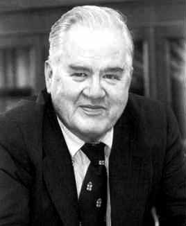

---
format:
  revealjs:
    highlight-style: github
    incremental: false
    theme: FANR6750.scss
    reference-location: document
knitr:
  opts_chunk:
    dev: png
    dev.args: { bg: "transparent" }
from: markdown+emoji
---

```{r setup}
#| echo: false
#| include: false
options(htmltools.dir.version = FALSE)
knitr::opts_chunk$set(echo = FALSE, fig.align = 'center', warning = FALSE,
                      message = FALSE, fig.retina = 2)
source(here::here("R/zzz.R"))
library(FANR6750data)
library(dplyr)
library(kableExtra)
```

## LECTURE 10: multiple comparisons {.theme-title .center}

::: footer
FANR 6750\
Fall 2026
:::

## Outline {.theme-inverse .smaller}

<br/>

### 1) Motivation

<br/>

::: {.fragment}
### 2) Pairwise *t*-tests

<br/>
:::

::: {.fragment}
### 3) Tukey's HSD test

<br/>
:::

::: {.fragment}
### 4) *a priori* contrasts

<br/>
:::

## Motivation {.smaller}

:::{.fragment}

> Following a significant *F*-test, the next step is to determine which means differ  

<br/>

:::

:::{.fragment}
> If all group means are to be compared, then we should correct for multiple testing

<br/>

:::

:::{.fragment}

> That is, conducting many tests increases the probability of finding one that is significant, even if it is not

:::

## Motivation

```{r echo = FALSE, out.height="600px"}
knitr::include_graphics("https://imgs.xkcd.com/comics/significant.png")
```

## Example {.smaller}

Aphids are a major crop pest and farmers are interested which brands of pesticide have the biggest influence on crop yield

The data:

```{r echo = TRUE}
#| fig-width: 6
#| fig-height: 4
data("pesticidedata")

ggplot(pesticidedata, aes(x = Brand, y = Yield)) + 
  geom_boxplot()
```

## Example {.smaller}

```{r echo = TRUE}
fit.lm <- lm(Yield ~ Brand, data = pesticidedata)
summary(fit.lm)
```

## Pairwise *t*-test {.theme-inverse .center}

## Pairwise *t*-test {.smaller}

<br/>

One can always fall back on pairwise, two-sample *t*-tests (or linear models)


<br/>

```{r echo = TRUE}
pairwise.t.test(pesticidedata$Yield, pesticidedata$Brand, p.adjust.method = "none")
```

## Pairwise *t*-test {.smaller}

One can always fall back on pairwise, two-sample *t*-tests (or linear models)...BUT

:::{.fragment}

Running multiple tests increases the probability of finding one that is significant, even if it is not (remember the jellybeans!)

```{r}
#| fig-width: 6
#| fig-height: 2.75
n <- 1:100
p <- 1 - (1 - 0.05)^n
p_df <- data.frame(n.test = n,p=p)
ggplot(p_df, aes(x = n.test, y = p)) + 
  geom_path(color = "grey25") +
  scale_x_continuous("Number of tests") +
  scale_y_continuous("Experiment-wise error rate") +
  theme(axis.title.y = element_text(size = 12))
```

:::

:::{.fragment}

One common way to deal with multiple comparisons is to do pairwise *t*-tests but *adjust* the *p*-values of each test

- Essentially, the adjustments make it harder to reject the null hypothesis, thereby making the tests more conservative

:::

## Bonferroni adjustment {.smaller}

One of the most common adjustments is the *Bonferroni* correction

- Multiply each *p*-value by the number of tests  

- If this results in *p* > 1, set *p* to 1  

:::{.fragment}

```{r echo = TRUE}
pairwise.t.test(pesticidedata$Yield, pesticidedata$Brand, p.adjust.method = "bonferroni")
```

:::

## Reflection {.theme-inverse .smaller}

At first, it can be confusing when a *p*-value is significant in one case (e.g., unadjusted) but not significant in another (e.g., Bonferroni)^[Especially if you're a grad student working on your thesis and you really *want* significant results]

<br/>

:::{.fragment}

If you find yourself in this situation, take a step back and think about a few things:

:::{.incremental}

- What does the p-value measure? What is the risk when rejecting the null hypothesis? 

- When is falsely rejecting the null hypothesis (Type I error) most likely?

- What is so special about $\alpha = 0.05$?

:::

:::

## Tukey's hsd test {.theme-inverse .center}

## John tukey {.smaller}

<br/>

```{r tukey, echo = FALSE, out.height="300px", out.width="246px"}

```

<br/>

> The combination of some data and an aching desire for an answer does not ensure that a reasonable answer can be extracted from a given body of data

## Tukey's hsd test {.smaller}

According to Tukey's Honestly Significant Difference test, two means ($\bar{y}_i$ and $\bar{y}_j$) are different if:

$$\large |\bar{y}_i - \bar{y}_j | \geq  q_{1- \alpha,a,a(n-1)}\sqrt{\frac{MSW}{n}}$$

<br/>

where $q$ comes from the "Studentized Range Distribution"(see `qtukey` in `R`). MSW = mean squared error from the ANOVA table

## Example {.smaller}

<br/>

```{r echo = TRUE}
fit.aov <- aov(Yield ~ Brand, data = pesticidedata)
TukeyHSD(fit.aov)
```

## *a posteriori* comparisons {.smaller}

:::{.incremental}

- Bonferonni and Tukey's HSD are the most commonly used types of *a posteriori* comparisons - comparing all possible pairwise combinations only *after* a significant F-test


- There are many other types of *a posteriori* comparison, e.g. Fisher's LSD (see `?p.adjust` for even more)


- *A posteriori* comparisons decrease the risk of Type I error (but increase the risk of Type II error)^[We'll discuss the trade off with Type II error in the next lecture]

- By forcing the researcher to correct for all possible combinations, *a posteriori* comparisons often overly conservative 


- A better approach in many situations is to use *a priori* **contrasts**

:::

## *a priori* contrasts {.theme-inverse .center}

## Mussel size {.smaller}

```{r echo = FALSE}
library(dplyr)
data("musseldata")

cs <- dplyr::mutate(musseldata, ID = rep(1:5, 4)) %>%
        tidyr::pivot_wider(names_from = Watershed, values_from = Length) %>%
         select(-ID)

cs %>%
  kable("html", align = 'c') %>%
  kable_styling(bootstrap_options = c("striped", "hover", "condensed"), full_width = TRUE) %>%
  add_header_above(c("Watershed" = 4))
```

:::{.fragment}

- Chattooga and Keowee are more forested  

- Coneross and Twelvemile are more agricultural
:::

## Anova results {.smaller}

```{r echo = TRUE}
fit.mussel <- lm(Length ~ Watershed, data = musseldata)
summary(fit.mussel)
```

## Pairwise comparisons {.smaller}

```{r echo = TRUE}
pairwise.t.test(musseldata$Length, musseldata$Watershed, p.adjust.method = "bonferroni")
```


## Hypotheses {.smaller}

Instead of comparing all possible combinations, what if we are only interested in some specific comparisons?

1) Do the agricultural watersheds differ from one another?

2) Do the forested watersheds differ from one another?

:::{.fragment}

Also, what if we are interested in *combinations* of treatments? 

3) Do mussels from forested watersheds differ from agricultural watersheds?

:::

:::{.fragment}
What are the advantages of focusing only on these specific questions?
:::


## Hypotheses as contrasts {.smaller}

[Hypotheses]{.highlight}

```{r echo = FALSE}
h0 <- data.frame(col1 = c("1", "2", "3"),
                 Comparison = c("Forested vs agricultural", 
                                "Twelvemile vs Coneross",
                                "Chattooga vs Keowee"),
                 H = c('\\(\\frac{\\mu_T + \\mu_{Co}}{2} - \\frac{\\mu_{Ch} + \\mu_K}{2}=0\\)',
                       '\\(\\mu_{T} - \\mu_{Ch} = 0\\)',
                       '\\(\\mu_{Ch} - \\mu_{K} = 0\\)'))

h0 %>%
    kable(align = c("l", "l", "c"), col.names = c("", "Comparisons", "H0 to test"), 
          booktabs = TRUE, escape = FALSE, format = "html") %>%
    kable_styling(bootstrap_options = c("condensed"), 
                full_width = FALSE, font_size = 16) 
```

:::{.fragment}
[Linear combinations]{.highlight}

```{r echo = FALSE}
lc <- data.frame(col1 = c("1", "2", "3"),
                 H = c('\\((1/2)\\mu_T - (1/2)\\mu_{Ch} - (1/2)\\mu_{K} + (1/2)\\mu_{Co}\\)',
                       '\\((1)\\mu_T + (0)\\mu_{Ch} + (0)\\mu_{K} - (1)\\mu_{Co}\\)',
                       '\\((0)\\mu_T + (1)\\mu_{Ch} - (1)\\mu_K + (0)\\mu_{Co}\\)'))

lc %>%
    kable(align = c("c", "l"), col.names = NULL, 
          booktabs = TRUE, escape = FALSE, format = "html") %>%
    kable_styling(bootstrap_options = c("condensed"), 
                full_width = FALSE, font_size = 16) 
```
:::


## Are these contrasts orthogonal? {.smaller}

A set of linear combinations is called a set of orthogonal contrasts^[Statistically, "orthogonal" is a type of independence. With regard to contrasts, orthogonal means that we can partition variability in the response variable between the different *a priori* hypotheses] if the following conditions hold for all pairs of linear combinations:  

:::{.fragment}

Given

$$L_1 = a_1\mu_1 + a_2\mu_2 + ... + a_a\mu_a$$

and

$$L_2 = b_1\mu_1 + b_2\mu_2 +...+ b_a\mu_a$$

then $L_1$ and $L_2$ are orthogonal if:

$$\sum_i a_i=0;\;\; \sum_i b_i=0; \;\;and \; \sum_i a_ib_i=0$$
:::


## Back to the saw data {.smaller}

Returning to the question: "Does mussel size differ among forested and agricultural watersheds?":

$$H_{0_1} = \frac{\mu_T + \mu_{Co}}{2} - \frac{\mu_{Ch} + \mu_{K}}{2} = 0$$

:::{.fragment}

Multiplying through by 2 gives:

$$H_{0_1} = (\mu_{T} + \mu_{Co}) - (\mu_{Ch} + \mu_K) = 0$$

:::

:::{.fragment}

Which can be written as^[Note that it's easier to work with coefficients that are integers rather than fractions]:
$$L1 = (1)\mu_T + (-1)\mu_{Ch} + (-1)\mu_K + (1)\mu_{Co}$$
where the coefficients are $a_1 = 1$, $a_2 = -1$, $a_3 = -1$, and $a_4 = 1$

:::


## Are the contrasts orthogonal? {.smaller}

:::{.fragment}

Does each set of coefficients sum to 0^[In practice, finding contrasts that are orthogonal often takes some trial and error]?

- $L_1$: $\sum_i a = 1 - 1 - 1 + 1 = 0$


- $L_2$: $\sum_i a  = 1 + 0 + 0 - 1 = 0$


- $L_3$: $\sum_i a  = 0 + 1 - 1 + 0 = 0$
:::

:::{.fragment}

Do the products of pairs of coefficients sum to 0?

- For $L_1$ and $L_2$: $(1)(1) + (-1)(0) + (-1)(0) + (1)(-1) = 0$

- For $L_1$ and $L_3$: $(1)(0) + (-1)(1) + (-1)(-1) + (1)(0) = 0$

- For $L_2$ and $L_3$: $(1)(0) + (0)(1) + (0)(-1) + (-1)(0) = 0$
:::


## Testing the null hypotheses {.smaller}

To obtain the sums of squares for each contrast, we use the general formula:

$$SS_L =\frac{(\sum_i a_i T_i)^2}{n \sum_i a_i^2}$$

where $T_i$ is the sum of observations in group $i$, and $a_i$ is the corresponding coefficient for group $i$  

:::{.fragment}

For thefirst hypothesis we have:

$$ SS_{L_1} = \frac{(66-107-121+77)^2}{5(1 + 1 + 1 + 1)} = 361.2$$
:::


## Sums of squares for each contrast {.smaller}

For the second hypothesis we have: $L_2 = \mu_T + 0 + 0 - \mu_{Co}$ with coefficients $a_i = (1, 0, 0,-1)$

$$SS_{L_2} = \frac{(66 +0 +0 - 77)^2}{5(1 + 0 + 0 + 1)} = 12.1$$

:::{.fragment}

For the third hypothesis we have: $L_3 = 0 + \mu_B - \mu_C + 0$ with coefficients $a_i = (0, 1,-1, 0)$

$$SS_{L_3} = \frac{(0 + 107 - 121 + 0)^2}{5(0 + 1 + 1 + 0)} = 19.6$$

:::


## Expanded anova table {.smaller}

For each contrast, each SS is divided by 1 d.f., and then divided by MSW

```{r echo = FALSE}
cs <- data.frame(Source = c("Among watersheds", "F vs Ag ", "T vs Co", "Ch vs K", "Within"),
                 df = c("3","1", "1", "1", "16"),
                 SS = c(393, 361, 12, 20, 216),
                 MS = c(131, 361, 12, 20, 13.5),
                 F = c(9.70, 26.76, 0.90, 1.45, NA),
                 p = c("0.007", "9e-5", "0.36", "0.25", NA))
options(knitr.kable.NA = '') # don't print NA's in table
cs %>%
    kable(align = c("r", "c", "c", "c", "c", "c"), 
          booktabs = TRUE, escape = FALSE, format = "html") %>%
    kable_styling(bootstrap_options = c("condensed"), 
                full_width = FALSE, font_size = 16) 
```

:::{.fragment}

Notice that the Sums of Squares are partitioned according to hypotheses we are interested in, unlike in multiple comparison procedures.

:::


## *a priori* contrasts {.smaller}

:::{.incremental}
- Orthogonal contrasts are more powerful than multiple comparison procedures  


- They also require more thought and preparation (good things!)  


- There can be only $a - 1$ comparisons  


- If the contrasts are not orthogonal, they can't be used to fully partition the Sums of Squares among groups  


- If the comparisons really represent more than 1 treatment variable, it will be better to use a factorial design. More on that later

:::

## Looking ahead

<br/>

[Next time]{.highlight}: Statistical power

<br/>

[Reading]{.highlight}: [Quinn chp. 7.3](https://www2.ib.unicamp.br/profs/fsantos/apostilas/Quinn%20&%20Keough.pdf#page=175.08)
