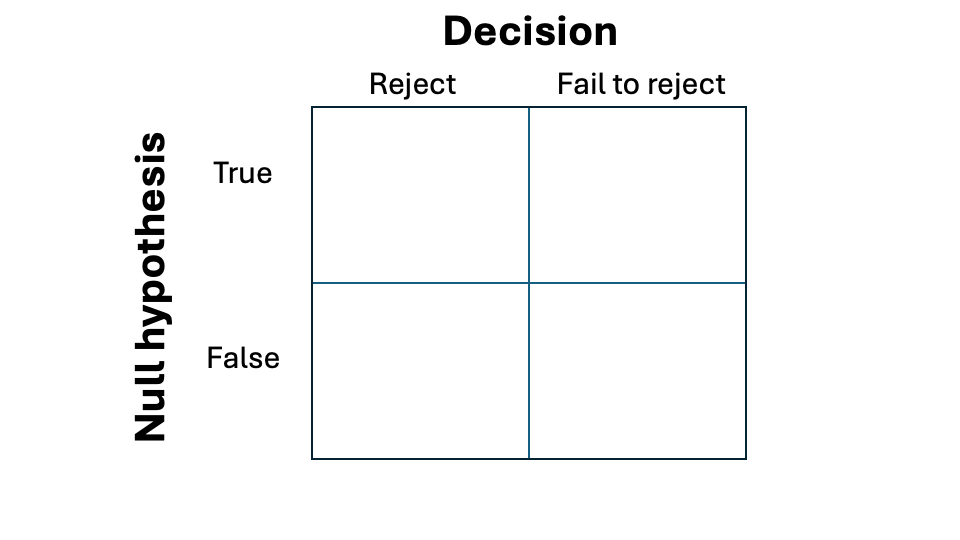
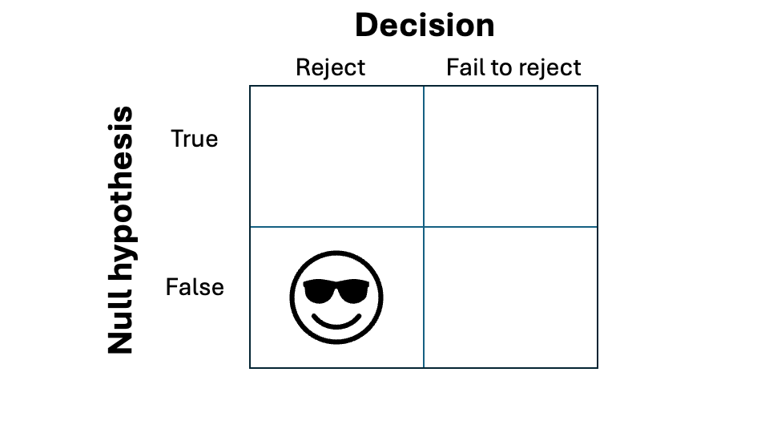
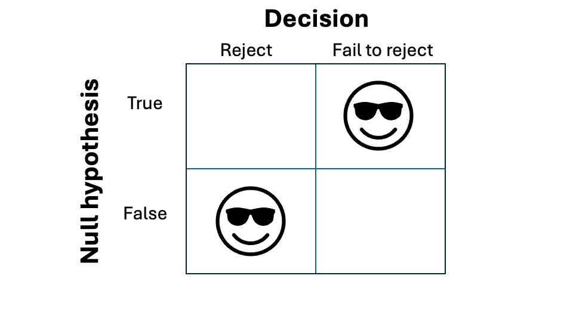
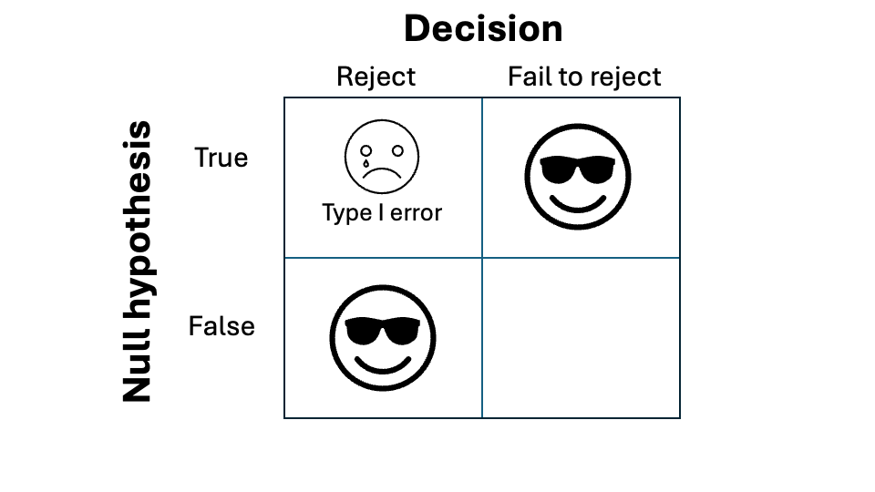
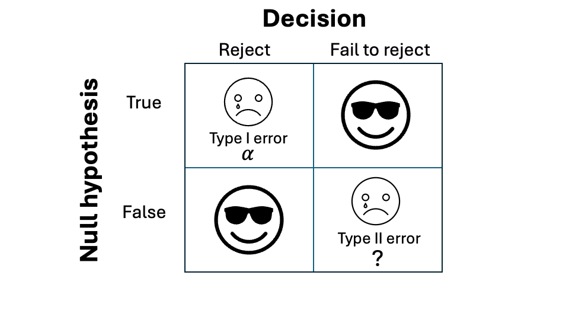

---
format:
  revealjs:
    highlight-style: github
    incremental: false
    theme: FANR6750.scss
    reference-location: document
knitr:
  opts_chunk:
    dev: png
    dev.args: { bg: "transparent" }
from: markdown+emoji
---

```{r setup}
#| echo: false
#| include: false
options(htmltools.dir.version = FALSE)
knitr::opts_chunk$set(echo = FALSE, fig.align = 'center', warning = FALSE,
                      message = FALSE, fig.retina = 2)
source(here::here("R/zzz.R"))
library(FANR6750)
library(dplyr)
library(kableExtra)
```

## LECTURE 11: statistical power {.theme-title .center}

::: footer
FANR 6750\
Fall 2026
:::

## Outline {.theme-inverse .smaller}

<br/>

### 1) Motivation

<br/>

::: {.fragment}
### 2) Type I and Type II error

<br/>
:::

::: {.fragment}
### 3) What influences power?

<br/>
:::


::: {.fragment}
### 4) Example (two-sample *t*-test)

<br/>
:::

## Motivation {.theme-inverse .smaller}

<br/>

> A statistical test will not be able to detect a true difference if the sample size is too small compared with the magnitude of the difference.

> Since data are sampled at random, there is always a risk of reaching a wrong conclusion, and things can go wrong in two ways - Dalgaard (2008)

## Null hypothesis testing {.smaller}



## Null hypothesis testing {.smaller}




## Null hypothesis testing {.smaller}




## Null hypothesis testing {.smaller}




## Null hypothesis testing {.smaller}


## Null hypothesis testing {.smaller}




## Null hypothesis testing {.smaller}


## Type i & type ii errors {.smaller}

Type I error (i.e., false positive)

> The null hypothesis is correct, but the test rejects it.

$$\alpha = Pr(Type\;I\;error)$$

:::{.fragment}

Type II error (i.e., false negative)

> The null hypothesis is wrong, but the test fails to reject it.

$$\beta = Pr(Type\;II\;error)$$

:::

:::{.fragment}

Power

> The test's ability to reject a false null hypothesis.

$$Power = 1 - \beta$$
:::

## Type i & type ii errors {.smaller}

The type I error rate is set by the scientist

<br/>

:::{.fragment}

The type II error rate, and hence the power of the test, depends on many factors  

<br/>

:::

:::{.fragment}

In the context of a linear model, these are:

:::{.incremental}

1) Magnitude of the slope coefficients ($\beta$)  

2) Standard deviation (or variance) of population ($\sigma$)  

3) The sample size ($n$)  

4) The Type I error rate ($\alpha$)  

:::

:::

## Magnitude of the difference

```{r echo = FALSE, fig.align="c"}
x <- seq(from = 0, to = 200, length.out = 200)

delta_df <- data.frame(x = x, 
                       y1 = c(dnorm(x, 98, 10), dnorm(x, 102, 10)),
                       y2 = c(dnorm(x, 80, 10), dnorm(x, 120, 10)),
                       y3 = c(dnorm(x, 80, 40), dnorm(x, 120, 40)),
                       population = rep(c("A", "B"), each = 200))

ggplot(delta_df, aes(x = x, y = y1, color = population)) +
  geom_path(size = 1.75) +
  scale_x_continuous("") +
  scale_y_continuous("") +
  guides(color = "none") +
  labs(subtitle = "Hard to detect a difference")
```


## Magnitude of the difference

```{r echo = FALSE, fig.align="c"}

ggplot(delta_df, aes(x = x, y = y2, color = population)) +
  geom_path(size = 1.75) +
  scale_x_continuous("") +
  scale_y_continuous("") +
  guides(color = "none") +
  labs(subtitle = "Easier to detect a difference")
```

## Standard deviation

```{r echo = FALSE, fig.align="c"}

ggplot(delta_df, aes(x = x, y = y2, color = population)) +
  geom_path(size = 1.75) +
  scale_x_continuous("") +
  scale_y_continuous("") +
  guides(color = "none") +
  labs(subtitle = "Easier to detect a difference")
```


## Standard deviation

```{r echo = FALSE, fig.align="c"}

ggplot(delta_df, aes(x = x, y = y3, color = population)) +
  geom_path(size = 1.75) +
  scale_x_continuous("") +
  scale_y_continuous("") +
  guides(color = "none") +
  labs(subtitle = "Hard to detect a difference")
```


## Sample size

::::{.columns}

:::{.column width="50%"}

```{r echo = FALSE, fig.align="c"}
delta_df <- data.frame(x = x, 
                       y1 = c(dnorm(x, 90, 10), dnorm(x, 100, 10)),
                       population = rep(c("A", "B"), each = 200))

n1 <- data.frame(x1 = c(rnorm(10, 90, 10), rnorm(10, 100, 10)),
                # x2 = c(rnorm(100, 97, 10), rnorm(100, 103, 10)),
                y = rep(c(0, 0.001), each = 10),
                population = rep(c("A", "B"), each = 10))

ggplot(delta_df, aes(x = x, y = y1, color = population)) +
  geom_path(size = 1.75) +
  geom_point(data = n1, aes(x = x1, y = y, color = population), alpha = 0.5) +
  scale_x_continuous("") +
  scale_y_continuous("") +
  guides(color = "none") +
  labs(subtitle = "Hard to detect a difference (n = 10)")
```

:::

:::{.column width="50%"}
```{r echo = FALSE, fig.align="c"}

ggplot() +
  geom_boxplot(data = n1, aes(y = x1, x = y, color = population), alpha = 0.5) +
  scale_x_continuous("") +
  scale_y_continuous("") +
  guides(color = "none") 
```

:::

::::


## Sample size

::::{.columns}

:::{.column width="50%"}

```{r echo = FALSE, fig.align="c"}
n2 <- data.frame(x1 = c(rnorm(1000, 90, 10), rnorm(1000, 100, 10)),
                y = rep(c(0, 0.001), each = 1000),
                population = rep(c("A", "B"), each = 1000))

ggplot(delta_df, aes(x = x, y = y1, color = population)) +
  geom_path(size = 1.75) +
  geom_point(data = n2, aes(x = x1, y = y, color = population), alpha = 0.25) +
  scale_x_continuous("") +
  scale_y_continuous("") +
  guides(color = "none") +
  labs(subtitle = "Easier to detect a difference (n = 1000)")
```
:::

:::{.column width="50%"}
```{r echo = FALSE, fig.align="c"}

ggplot() +
  geom_boxplot(data = n2, aes(y = x1, x = y, color = population), alpha = 0.5) +
  scale_x_continuous("") +
  scale_y_continuous("") +
  guides(color = "none") 
```
:::

::::


## Type i error rate {.smaller}

$\alpha = 0.05$

```{r cv, fig.height = 6, fig.width=8}
ggplot(NULL, aes(c(-5,5))) +
  geom_area(stat = "function", fun = dnorm, fill = "#00998a", xlim = c(-5, qnorm(0.025, 0, 1))) +
  geom_area(stat = "function", fun = dnorm, fill = "grey80", xlim = c(qnorm(0.025, 0, 1), qnorm(0.975, 0, 1))) +
  geom_area(stat = "function", fun = dnorm, fill = "#00998a", xlim = c(qnorm(0.975, 0, 1), 5)) +
  labs(subtitle = "Easier to detect difference", x = "t", y = "") +
  scale_y_continuous(breaks = NULL) +
  scale_x_continuous(breaks = c(qnorm(0.025, 0, 1), qnorm(0.975, 0, 1)))
```


## type i error rate {.smaller}

$\alpha = 0.001$

```{r cv2, fig.height = 6, fig.width=8}
ggplot(NULL, aes(c(-5,5))) +
  geom_area(stat = "function", fun = dnorm, fill = "#00998a", xlim = c(-5, qnorm(0.005, 0, 1))) +
  geom_area(stat = "function", fun = dnorm, fill = "grey80", xlim = c(qnorm(0.005, 0, 1), qnorm(0.995, 0, 1))) +
  geom_area(stat = "function", fun = dnorm, fill = "#00998a", xlim = c(qnorm(0.995, 0, 1), 5)) +
  labs(subtitle = "Harder to detect difference", x = "t", y = "") +
  scale_y_continuous(breaks = NULL) +
  scale_x_continuous(breaks = c(qnorm(0.005, 0, 1), qnorm(0.995, 0, 1)))
```


## Factors affecting power {.smaller}

In general, power increases when:

:::{.incremental}

1) The difference in means/magnitude of slope increases  

2) The standard deviation **of the population** decreases  

3) The sample size increases  

4) The Type I error rate increases  

:::

:::{.fragment}

[Question]{.highlight}: Which of these, as researchers, do we have control over?

:::


## Example in `R` {.smaller}

::::{.columns}

:::{.column width="50%"}

$\mu_1 = 90$, $\mu_2 = 100$

$\sigma = 5$

```{r}
delta_df <- data.frame(x = x, 
                       y1 = c(dnorm(x, 90, 5), dnorm(x, 100, 5)),
                       population = rep(c("A", "B"), each = 200))

n2 <- data.frame(x1 = c(rnorm(5, 90, 5), rnorm(5, 100, 5)),
                 y = rep(c(0, 0.001), each = 5),
                 population = rep(c("A", "B"), each = 5))
mu_df <- data.frame(population = c("A", "B"),
                    mu = c(90, 100))

ggplot(delta_df, aes(x = x, y = y1, color = population)) +
  geom_path(size = 1.75) +
  # geom_point(data = n2, aes(x = x1, y = y, color = population), alpha = 0.75) +
  geom_vline(data = mu_df, aes(xintercept = mu, color = population), 
             linetype = "dashed", size = 1) +
  scale_y_continuous("") +
  guides(color = "none") +
  scale_x_continuous("", limits = c(70, 120), breaks = c(90, 100)) +
  theme(axis.text.x = element_text(size = 20))
```

:::

::::


## Example in `R` {.smaller}

::::{.columns}

:::{.column width="50%"}

$\mu_1 = 90$, $\mu_2 = 100$

$\sigma = 5$

```{r}
delta_df <- data.frame(x = x, 
                       y1 = c(dnorm(x, 90, 5), dnorm(x, 100, 5)),
                       population = rep(c("A", "B"), each = 200))

n2 <- data.frame(x1 = c(rnorm(5, 90, 5), rnorm(5, 100, 5)),
                 y = rep(c(0, 0.001), each = 5),
                 population = rep(c("A", "B"), each = 5))
mu_df <- data.frame(population = c("A", "B"),
                    mu = c(90, 100))

ggplot(delta_df, aes(x = x, y = y1, color = population)) +
  geom_path(size = 1.75) +
  geom_point(data = n2, aes(x = x1, y = y, color = population), alpha = 0.75) +
  geom_vline(data = mu_df, aes(xintercept = mu, color = population), 
             linetype = "dashed", size = 1) +
  scale_y_continuous("") +
  guides(color = "none") +
  scale_x_continuous("", limits = c(70, 120), breaks = c(90, 100)) +
  theme(axis.text.x = element_text(size = 20))
```
:::


:::{.fragment .column width="50%"}
$n = 5$

```{r echo = TRUE}
power.t.test(n = 5, 
             delta = 10, 
             sd = 5, 
             sig.level = 0.05, 
             power = NULL)
```

:::

::::

## Example in `R` {.smaller}

::::{.columns}

:::{.column width="50%"}

$\mu_1 = 90$, $\mu_2 = 100$

$\sigma = 5$

```{r}
delta_df <- data.frame(x = x, 
                       y1 = c(dnorm(x, 90, 5), dnorm(x, 100, 5)),
                       population = rep(c("A", "B"), each = 200))

n2 <- data.frame(x1 = c(rnorm(15, 90, 5), rnorm(15, 100, 5)),
                 y = rep(c(0, 0.001), each = 15),
                 population = rep(c("A", "B"), each = 15))
mu_df <- data.frame(population = c("A", "B"),
                    mu = c(90, 100))

ggplot(delta_df, aes(x = x, y = y1, color = population)) +
  geom_path(size = 1.75) +
  geom_point(data = n2, aes(x = x1, y = y, color = population), alpha = 0.75) +
  geom_vline(data = mu_df, aes(xintercept = mu, color = population), 
             linetype = "dashed", size = 1) +
  scale_y_continuous("") +
  guides(color = "none") +
  scale_x_continuous("", limits = c(70, 120), breaks = c(90, 100)) +
  theme(axis.text.x = element_text(size = 20))
```
:::

:::{.column width="50%"}


$n = 15$
```{r echo = TRUE}
power.t.test(n = 15, 
             delta = 10, 
             sd = 5, 
             sig.level = 0.05, 
             power = NULL)
```
:::

::::


## Example in `R` {.smaller}

::::{.columns}

:::{.column width="50%"}

$\mu_1 = 90$, $\mu_2 = 100$

$\sigma = 5$

```{r}
delta_df <- data.frame(x = x, 
                       y1 = c(dnorm(x, 90, 5), dnorm(x, 100, 5)),
                       population = rep(c("A", "B"), each = 200))

n2 <- data.frame(x1 = c(rnorm(15, 90, 5), rnorm(15, 100, 5)),
                 y = rep(c(0, 0.001), each = 15),
                 population = rep(c("A", "B"), each = 15))
mu_df <- data.frame(population = c("A", "B"),
                    mu = c(90, 100))

ggplot(delta_df, aes(x = x, y = y1, color = population)) +
  geom_path(size = 1.75) +
  geom_point(data = n2, aes(x = x1, y = y, color = population), alpha = 0.75) +
  geom_vline(data = mu_df, aes(xintercept = mu, color = population), 
             linetype = "dashed", size = 1) +
  scale_y_continuous("") +
  guides(color = "none") +
  scale_x_continuous("", limits = c(70, 120), breaks = c(90, 100)) +
  theme(axis.text.x = element_text(size = 20))
```
:::

:::{.column width="50%"}
$\alpha = 0.001$

```{r echo = TRUE}
power.t.test(n = 15, 
             delta = 10, 
             sd = 5, 
             sig.level = 0.001, 
             power = NULL)
```
:::

::::

## Example in `R` {.smaller}

::::{.columns}

:::{.column width="50%"}

$\mu_1 = 94$, $\mu_2 = 97$

$\sigma = 5$

```{r}
delta_df <- data.frame(x = x, 
                       y1 = c(dnorm(x, 94, 5), dnorm(x, 97, 5)),
                       population = rep(c("A", "B"), each = 200))

n2 <- data.frame(x1 = c(rnorm(15, 94, 5), rnorm(15, 97, 5)),
                 y = rep(c(0, 0.001), each = 15),
                 population = rep(c("A", "B"), each = 15))
mu_df <- data.frame(population = c("A", "B"),
                    mu = c(94, 97))

ggplot(delta_df, aes(x = x, y = y1, color = population)) +
  geom_path(size = 1.75) +
  geom_point(data = n2, aes(x = x1, y = y, color = population), alpha = 0.75) +
  geom_vline(data = mu_df, aes(xintercept = mu, color = population), 
             linetype = "dashed", size = 1) +
  scale_y_continuous("") +
  guides(color = "none") +
  scale_x_continuous("", limits = c(70, 120), breaks = c(94, 97)) +
  theme(axis.text.x = element_text(size = 20))
```
:::

:::{.column width="50%"}

$n = 15$

```{r echo = TRUE}
power.t.test(n = 15, 
             delta = 3, 
             sd = 5, 
             sig.level = 0.001, 
             power = NULL)
```

:::

::::

 
## Example in `R` {.smaller}

::::{.columns}

:::{.column width="50%"}

$\mu_1 = 94$, $\mu_2 = 97$

$\sigma = 5$

```{r}
delta_df <- data.frame(x = x, 
                       y1 = c(dnorm(x, 94, 5), dnorm(x, 97, 5)),
                       population = rep(c("A", "B"), each = 200))

n2 <- data.frame(x1 = c(rnorm(100, 94, 5), rnorm(100, 97, 5)),
                 y = rep(c(0, 0.001), each = 100),
                 population = rep(c("A", "B"), each = 100))
mu_df <- data.frame(population = c("A", "B"),
                    mu = c(94, 97))

ggplot(delta_df, aes(x = x, y = y1, color = population)) +
  geom_path(size = 1.75) +
  geom_point(data = n2, aes(x = x1, y = y, color = population), alpha = 0.75) +
  geom_vline(data = mu_df, aes(xintercept = mu, color = population), 
             linetype = "dashed", size = 1) +
  scale_y_continuous("") +
  guides(color = "none") +
  scale_x_continuous("", limits = c(70, 120), breaks = c(94, 97)) +
  theme(axis.text.x = element_text(size = 20))
```
:::

:::{.column width="50%"}

$n = 100$

```{r echo = TRUE}
power.t.test(n = 100, 
             delta = 3, 
             sd = 5, 
             sig.level = 0.001, 
             power = NULL)
```

:::

::::


## When should I do a power analysis? {.smaller}

:::{.fragment}

**Retrospective** (conducted after experiment) 

- If you failed to reject the null, then your power was low  

- But you can't use this as an excuse!  

- Only useful as a way of planning a subsequent experiment  

:::

:::{.fragment}

**Prospective** (Done before the experiment)  

- Used to determine sample size or power, given $\beta$ and $\sigma$

- How can $\beta$  and/or $\sigma$ be known ahead of time?  

    + Requires prior knowledge, perhaps from a pilot study

    + Requires clear-headed thinking about what consitutes a biologically signiffcant difference

:::

:::{.fragment}

Prospective is always better than retrospective!

:::


## What level of power should I aim for? {.smaller}

<br/>

We want power to be as close to 1 as possible


:::{.fragment}

<br/>

Sometimes it may be prohibitively expensive to obtain a sample size large enough to achieve power close to 1

:::

:::{.fragment}

<br/>

In practice, we are usually satisfied with power > 0.8

:::


## Summary {.smaller}

:::{.incremental}
- Power analysis let's you determine the necessary sample size (or power) for testing an effect size of interest


- Power is influenced by the magnitude of the effect, the standard deviation of the population, the Type I error rate, and the sample size


- Retrospective power analysis isn't useful unless you are planning a subsequent experiment
 

- `R` has several functions for conducting power analysis, but only for simple tests


- More complicated power analysis can be performed using simulation (not covered in this course)

:::

## Looking ahead

<br/>

[Next time]{.highlight}: Multiple regression, part 1

<br/>

[Reading]{.highlight}: [Fieberg chp. 3.2-3.5](https://statistics4ecologists-v3.netlify.app/03-multipleregression#introduction-to-multiple-regression) and [Fieberg chp. 7.3](https://statistics4ecologists-v3.netlify.app/07-causalnetworks#directed-acyclical-graphs-and-conditional-independencies)

