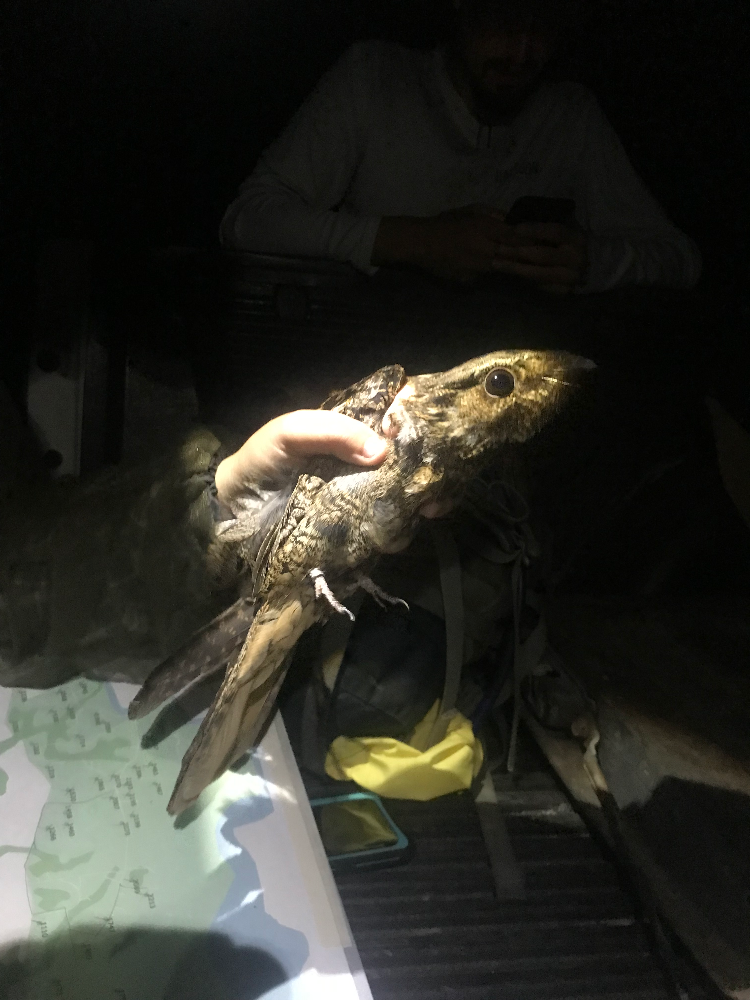

---
format:
  revealjs:
    highlight-style: github
    incremental: false
    theme: FANR6750.scss
    reference-location: document
knitr:
  opts_chunk:
    dev: png
    dev.args: { bg: "transparent" }
from: markdown+emoji
---

```{r setup}
#| echo: false
#| include: false
options(htmltools.dir.version = FALSE)
knitr::opts_chunk$set(echo = FALSE, fig.align = 'center', warning = FALSE,
                      message = FALSE, fig.retina = 2)
source(here::here("R/zzz.R"))
library(FANR6750)
library(dplyr)
library(kableExtra)
```

## LECTURE 13: mutiple regression, part 2: interactions {.theme-title .center}

::: footer
FANR 6750\
Fall 2026
:::

## Outline {.theme-inverse .smaller}

<br/>

### 1) Interpreting interactions between factor and continuous predictor

<br/>

::: fragment
### 2) Interpreting interactions between two factors

<br/>
:::

::: fragment
### 3) Interpreting interactions between two continuous predictors

<br/>
:::

## Multiple regression {.smaller}

In the last lecture, we learned about fitting and interpreting multiple regression models of the form:

$$y_i = \beta_0 + \beta_1 \times X1_i + \beta_2 \times X2_i + \epsilon_i$$ $$\epsilon_i \sim normal(0, \sigma)$$

::: fragment
In all of the examples, we treated $X1$ and $X2$ as independent predictors of the response variables $y$
:::

::: fragment
Often, however, we expect --- or at least want to test --- whether the predictors *interact*

::: incremental
-   Interactions imply that the effect of one predictor depends on the value of the other predictors

-   Interpreting the output of models with interactions is a common source of confusion
:::
:::

## Interactions {.smaller}

Visually, interactions are indicated by significant departure from parallelism

::: columns
::: {.column width="50%"}
```{r}
#| fig-width: 5
#| fig-height: 4
df1 <- data.frame(X = runif(100, 0, 10),
                  group = sample(c(0, 1), size = 100, replace = TRUE))
df1 <- dplyr::mutate(df1, lp.x = -2 + 3 * group + 1.2 * X - 0.9 * group * X,
                     lp = -2 + 3 * group + 1.2 * X,
                     eps = rnorm(100))
df1 <- dplyr::mutate(df1, y.x = lp.x + eps,
                     y = lp + eps)
df1 <- dplyr::mutate(df1, Treatment = ifelse(group == 0, "A", "B"))

ggplot(df1, aes(x = X, y = y, color = Treatment)) + 
  geom_point() + 
  geom_abline(intercept = -2, slope = 1.2, color = "#446E9B") +
  geom_abline(intercept = 1, slope = 1.2, color = "#D47500")
```
:::

::: {.column width="50%"}
```{r}
#| fig-width: 5
#| fig-height: 4
ggplot(df1, aes(x = X, y = y.x, color = Treatment)) + 
  geom_point() + 
  geom_abline(intercept = -2, slope = 1.2, color = "#446E9B") +
  geom_abline(intercept = 1, slope = 0.3, color = "#D47500") +
  scale_y_continuous("")
```
:::
:::

::: fragment
Interactions can also be formally tested
:::

## Redstart example {.smaller}

American redstarts (*Setophaga ruticilla*) are migratory birds that spend the winter in the Caribbean and Central America. During the winter, both males and females defend territories, which vary in quality. In early spring, individuals depart the wintering grounds to migrate back to North America.

Researchers in Jamaica used automated telemetry to record the departure time of 30 male and 30 females, with the goal of measuring how territory quality (measured by sampling insect abundance) influences departure timing.

::: columns
::: {.column width="50%"}
```{r out.height="90%", out.width="90%"}
knitr::include_graphics("https://upload.wikimedia.org/wikipedia/commons/0/05/American_Redstart_-_52054405838.jpg")
```
:::

::: {.column width="50%"}
```{r fig.height = 3.5, fig.width=5}
data("departuredata")
ggplot(departuredata, aes(x = Quality, y = Departure, color = Sex)) +
  geom_point() +
  stat_smooth(method = "lm") +
  scale_x_continuous("Territory quality") +
  scale_y_continuous("Depature date")
```
:::
:::

## Redstart example {.smaller}

```{r echo = TRUE}
data("departuredata")
fm1 <- lm(Departure ~ Sex * Quality, data = departuredata)
summary(fm1)
```

::: fragment
How do we interpret these parameters?
:::

## Design matrix {.smaller}

::: columns
::: {.column width="50%"}
```{r}
broom::tidy(fm1)
```
:::

::: {.column width="50%"}
```{r echo = TRUE}
model.matrix(fm1)[c(1,2,31,32),]
```
:::
:::

::: fragment
$$\begin{bmatrix}
    1 & 1 & 43.68 & 43.68 \\
    1 & 1 & 45.30 & 45.30 \\
    1 & 0 & 26.94 & 0.00 \\
    1 & 0 & 52.86 & 0.00 
\end{bmatrix}\;\;
\mathbf \times \begin{bmatrix}
    \color{#D47500}{(Intercept)} \\
     \color{#D47500}{SexM} \\
     \color{#D47500}{Quality} \\
     \color{#D47500}{SexM:Quality}
\end{bmatrix}$$
:::

::: fragment
$$\begin{bmatrix}
    \color{#D47500}{40.6}^*1 + \color{#D47500}{-20.4} ^* 1 + \color{#D47500}{-0.23}^*43.68  + \color{#D47500}{0.18}^*(1 \times 43.68) \\
    \color{#D47500}{40.6}^*1 + \color{#D47500}{-20.4} ^* 1 + \color{#D47500}{-0.23}3^*45.30 + \color{#D47500}{0.18}^*(1 \times 45.30) \\
    \color{#D47500}{40.6}^*1 + \color{#D47500}{-20.4} ^* 0 + \color{#D47500}{-0.23}^*26.94 + \color{#D47500}{0.18}^*(0 \times 26.94) \\
    \color{#D47500}{40.6}^*1 + \color{#D47500}{-20.4}^* 0 + \color{#D47500}{-0.23}^*52.86 + \color{#D47500}{0.18}^*(0 \times 52.86)
\end{bmatrix}$$
:::

## Interpreting interactions {.smaller}

Expected departure date of individual 4 (female):

$$E[departure_4] = \underbrace{\color{#D47500}{40.6}}_{(Intercept)} + \underbrace{\color{#D47500}{- 0.23}}_{Quality} \times \underbrace{52.86}_{X_4} = 28.4$$

::: incremental
-   `(Intercept)` = Expected departure date of female with territory quality = 0

-   `Quality` = Change in **female** departure date for every unit change in territory quality
:::

## Interpreting interactions {.smaller}

Expected departure date of individual 1 (male):

$$E[departure_1] = \underbrace{\color{#D47500}{40.6}}_{(Intercept)} + \underbrace{\color{#D47500}{-20.4}}_{SexM} + \underbrace{\color{#D47500}{-0.23}}_{Quality} \times 43.68 + \underbrace{\color{#D47500}{0.18}}_{SexM:Quality} \times 43.68 =$$

::: fragment
$$\color{#D47500}{20.2} + \color{#D47500}{(- 0.23 + 0.18)} ^* 43.68 = \color{#D47500}{20.2} + \color{#D47500}{- 0.05} \times 43.68 = 18.0 $$

::: incremental
-   `(Intercept)` = Expected departure date of female with territory quality = 0

-   `Quality` = Change in **female** departure date for every unit change in territory quality

-   `SexM` = **Difference** in expected departure date of females and males with territory quality = 0

-   `Sex:MQuality` = **Difference** in change in departure date of females and males for every unit change in territory quality
:::
:::

## Redstart example {.smaller}

```{r}
#| fig-width: 8
#| fig-height: 6
data("departuredata")
ggplot(departuredata, aes(x = Quality, y = Departure, color = Sex)) +
  geom_vline(xintercept = 0, color = "grey40", linetype = "dashed") +
  geom_point() +
  stat_smooth(method = "lm", fullrange = TRUE) +
  scale_x_continuous("Territory quality", limits = c(0, 100)) +
  scale_y_continuous("Depature date", limits = c(15, 45)) +
  geom_segment(aes(x = 25, xend = 0, y = 42, yend = 40.6),
               arrow = arrow(length = unit(0.02, "npc"))) +
  annotate("text", label = "Intercept", x = 26, y = 42, hjust = 0, color = "#446E9B") +
  geom_segment(aes(x = 5, xend = 0, y = 26, yend = 19.8),
               arrow = arrow(length = unit(0.02, "npc")), color = "#D47500") +
  annotate("text", label = "(Intercept + SexM)", x = 5.5, y = 26, hjust = 0, 
           color = "#D47500") +
  geom_segment(aes(x = 58, xend = 50, y = 32, yend = 29.1),
               arrow = arrow(length = unit(0.02, "npc"))) +
  annotate("text", label = "Quality", x = 59, y = 32, hjust = 0, color = "#446E9B") +
  geom_segment(aes(x = 27, xend = 25, y = 22, yend = 18.75),
               arrow = arrow(length = unit(0.02, "npc")), color = "#D47500") +
  annotate("text", label = "(Quality + SexM:Quality)", x = 27, y = 22.5, hjust = 0, 
           color = "#D47500")
  
```

## Interactions between factors {.smaller}

<br/>

Often an investigator is interested in the combined effect of two types of treatments\
<br/>

::: fragment

For example, a study might examine the effects of **predation** and **food supplementation** on *Microtus californicus* abundance

:::

::: fragment
<br/>

We "seed" each enclosure with 10 *Microtus* and record the number of voles present after a specified period of time.
:::

## *Microtus californicus* {.smaller}

{width="80%"}

## *Microtus* example {.smaller}

```{r}
data("microtusdata")
ggplot(microtusdata, aes(x = food, y = voles, color = predators)) +
  geom_boxplot() +
  scale_y_continuous("Microtus abundance") +
  scale_x_discrete("Food supplementation", labels = c("Low", "Medium", "High")) 
```

## *Microtus* example {.smaller}

```{r echo = TRUE}
data("microtusdata")
fm2 <- lm(voles ~ food * predators, data = microtusdata)
summary(fm2)
```

::: fragment
How do we interpret these parameters?
:::

## Interpreting interactions {.smaller}

Food = 0, predators absent:

$$E[voles] = \color{#D47500}{13.5} ^* 1 + \color{#D47500}{18.0}^*0 + \color{#D47500}{28.5}^*0 + \color{#D47500}{-2.5}^*0+\color{#D47500}{-8.25}^*0 + \color{#D47500}{-22.5}^*0=13.5$$

::: fragment
Food = 0, predators present:

$$E[voles] = \color{#D47500}{13.5} ^* 1 + \color{#D47500}{18.0}^*0 + \color{#D47500}{28.5}^*0 + \color{#D47500}{-2.5}^*1+\color{#D47500}{-8.25}^*0 + \color{#D47500}{-22.5}^*0=11.0$$
:::

::: fragment
Food = 1, predators absent:

$$E[voles] = \color{#D47500}{13.5} ^* 1 + \color{#D47500}{18.0}^*1 + \color{#D47500}{28.5}^*0 + \color{#D47500}{-2.5}^*0+\color{#D47500}{-8.25}^*0 + \color{#D47500}{-22.5}^*0=31.5$$
:::

::: fragment
Food = 1, predators present:

$$E[voles] = \color{#D47500}{13.5} ^* 1 + \color{#D47500}{18.0}^*1 + \color{#D47500}{28.5}^*0 + \color{#D47500}{-2.5}^*1+\color{#D47500}{-8.25}^*1 + \color{#D47500}{-22.5}^*0=23.25$$
:::

## *Microtus* example {.smaller}

```{r}
microtus_summary <- group_by(microtusdata, food, predators) %>% summarise(mu = mean(voles))
ggplot(microtusdata, aes(x = food, y = voles, color = predators)) +
  geom_point(alpha = 0.5, position = position_jitter(width = 0.2, height = 0)) +
  geom_segment(data = microtus_summary, aes(x = as.numeric(food)-0.25,
                                            xend = as.numeric(food)+0.25, 
                                            yend = mu, y = mu, 
                                            color = predators), size = 1) +
  scale_y_continuous("Microtus abundance") +
  scale_x_discrete("Food supplementation") +
  annotate("text", label = "Intercept", x = 1.275, y = 13.5, hjust = 0, 
           color = "#446E9B") +
  annotate("text", label = "(Intercept + \npredatorsPresent)", x = 1.275, y = 10, hjust = 0,
           color = "#D47500") +
  annotate("text", label = "(Intercept + food1)", x = 1.725, y = 31.5, hjust = 1, 
           color = "#446E9B") +
  annotate("text", label = "(Intercept + food1 \n+ predatorsPresent \n+ food1:predatorsPresent)", x = 1.725, y = 21, 
           hjust = 1, color = "#D47500") +
  annotate("text", label = "(Intercept + food2)", x = 2.725, y = 42, hjust = 1, 
         color = "#446E9B") +
  annotate("text", label = "(Intercept + food2 \n+ predatorsPresent \n+ food2:predatorsPresent)", x = 3, y = 25, 
           hjust = 0.5, color = "#D47500") +
  geom_segment(aes(x = 3.2, xend = 3.2, y = 22, yend = 17.1),
               arrow = arrow(length = unit(0.02, "npc")), color = "#D47500") 
```

## Factorial designs {.smaller}

This design is called a factorial design.

::: incremental
-   Factorial designs have two (or more) treatments

-   Because there are 2 levels of predation and 3 levels of food supplementation, this is a $2 \times 3$ factorial design

-   The treatment variables are called **factors** or main effects, and the different treatments within factors are called **levels**

-   To test for interactions, there must be replication for each combination of factors. Replication of each combination of factors differs from blocking designs

-   It helps (though is not strictly necessary) for the replication to be balanced, i.e. the same number of replicates for each combination of factors
:::

## More on interactions {.smaller}

If an interaction is significant, then the effect of one factor depends on the other factor

::: fragment
-   Always test the highest order interaction first, then lower level interactions, then main effects
:::

::: fragment
Thus, if an interaction is significant, then usually it is ill-advised to further investigate main effects alone (such as with multiple comparison procedures) without taking the other factor into account
:::

::: fragment
The way that you do this is to perform a multiple comparison test for one factor at each level of the other factor, and vice versa

-   This is easily performed in `R` as we will see in lab
:::

## Interactions between continuous predictors {.smaller}

Finally, we will look at interactions between continuous predictors

:::{.fragment}

Chuck-will's-widow are nocturnal birds of high conservation concern. To improve the design of monitoring surveys, researchers are interested in how call rate is influenced by moon phase and cloud cover.

:::

::::{.columns .fragment}
::: {.column width="50%"}
{width="60%" fig-align="c"}
:::

::: {.column width="50%"}
```{r fig.height = 3.5, fig.width=5}
data("chuckdata")
ggplot(chuckdata, aes(x = moon, y = call.rate, size = cloud)) +
  geom_point() +
  scale_x_continuous("Moon (% of full)") +
  scale_y_continuous("Call rate") +
  guides(size=guide_legend(title="% cloud cover"))
```
:::
:::

## Chuck example {.smaller}

```{r echo = TRUE}
data("chuckdata")
fm4 <- lm(call.rate ~ moon * cloud, data = chuckdata)
summary(fm4)
```

## Interactions between continuous predictors {.smaller}

$$E[y_i] = \color{#D47500}{\beta_0} + \color{#D47500}{\beta_1}^*moon_i + \color{#D47500}{\beta_2}^*cloud_i + \color{#D47500}{\beta_3}^*(moon_i \times cloud_i)$$

::: fragment

$$E[y_i] = \color{#D47500}{\beta_0} + (\color{#D47500}{\beta_1 + \beta_3}^*cloud_i)^*moon_i + \color{#D47500}{\beta_2}^*cloud_i$$

:::

## Interactions between continuous predictors {.smaller}

$$E[y_i] = \color{#D47500}{\beta_0} + (\color{#D47500}{\beta_1 + \beta_3}^*cloud_i)^*moon_i + \color{#D47500}{\beta_2}^*cloud_i$$ 

:::{.fragment}

Cloud = 0

$$\color{#D47500}{\beta_0} + (\color{#D47500}{\beta_1 + \beta_3}^*0)^*moon_i + \color{#D47500}{\beta_2}^*0$$

-   $\color{#D47500}{\beta_0}$ (i.e., `Intercept`) = expected call rate when both moon and cloud = 0

-   $\color{#D47500}{\beta_1}$ (i.e., `moon` ) = change in call rate from 0% to 100% moon **when cloud = 0**

:::

::: {.fragment}

Cloud = 1

$$\color{#D47500}{\beta_0} + (\color{#D47500}{\beta_1 + \beta_3}^*1)^*moon_i + \color{#D47500}{\beta_2}^*1$$

-   $\color{#D47500}{\beta_2}$ (i.e., `cloud`)= change in call rate from 0% to 100% cloud cover **when moon = 0**

-   $\color{#D47500}{\beta_3}$ (i.e., `moon:cloud`) = change in effect of moon between 0% and 100% cloud cover (or vice versa)

:::

## Interactions between continuous predictors {.smaller}

```{r}
#| fig-width: 8
#| fig-height: 6
pred_df <- data.frame(a = c(2.582, (2.582+0.228*0.5), (2.582+0.228*1)),
                      b = c(2.734, (2.734-2.387*0.5), (2.734-2.387*1)),
                      cloud = factor(c("0", "0.5", "1"), levels = c("0", "0.5", "1")))

ggplot(chuckdata, aes(x = moon, y = call.rate)) +
  geom_blank() +
  geom_abline(data = pred_df, aes(intercept = a, slope = b, color = cloud), size = 1) +
  scale_y_continuous("Call Rate", limits = c(2, 6)) +
  scale_x_continuous("Moon (% of full)") +
  geom_vline(xintercept = 0, linetype = "dashed", color = "grey40") +
  annotate("text", label = "Intercept", x = 0.01, y = 2, hjust = 0, 
           color = "#446E9B") +
  geom_segment(aes(y = 2.1, yend = 2.55, x = 0.025, xend = 0),
               arrow = arrow(length = unit(0.02, "npc")), color = "#446E9B") +
  annotate("text", label = "Intercept + cloud*0.5", x = 0.21, y = 2.45, hjust = 0, 
           color = "#D47500") +
  geom_segment(aes(y = 2.45, yend = 2.68, x = 0.2, xend = 0),
               arrow = arrow(length = unit(0.02, "npc")), color ="#D47500") +
  annotate("text", label = "Intercept + cloud*1", x = 0.06, y = 3.7, hjust = 0, 
           color = "#3CB521") +
  geom_segment(aes(y = 3.7, yend = 2.82, x = 0.05, xend = 0),
               arrow = arrow(length = unit(0.02, "npc")), color ="#3CB521") +
  annotate("text", label = "moon", x = 0.39, y = 4.22, hjust = 1, 
           color = "#446E9B") +
  geom_segment(aes(y = 4.2, yend = 4, x = 0.4, xend = 0.5),
               arrow = arrow(length = unit(0.02, "npc")), color = "#446E9B") +
  annotate("text", label = "moon + moon:cloud*0.5", x = 0.9, y = 3.4, hjust = 1, 
           color = "#D47500") +
  geom_segment(aes(y = 3.45, yend = 3.7, x = 0.7, xend = 0.68),
               arrow = arrow(length = unit(0.02, "npc")), color ="#D47500") +
  annotate("text", label = "moon + moon:cloud*1", x = 0.9, y = 2.7, hjust = 1, 
           color = "#3CB521") +
  geom_segment(aes(y = 2.75, yend = 3.02, x = 0.72, xend = 0.7),
               arrow = arrow(length = unit(0.02, "npc")), color ="#3CB521")
```

## Interpreting interactions {.smaller}

Notice that the interpretation of the "main effects" $\beta_1$ and $\beta_2$ changes when there is an interaction in the model:

::: incremental

- Main effects measure the effect of one predictor **when the other predictor is 0**

- Because interactions change the meaning of the main effects, **you cannot** directly compare "main effect" estimates from models with and without interactions

:::

::: {.fragment}

Centering and standardizing predictors

::: {.incremental}

- In many cases, a value of 0 for a predictor is not meaningful (e.g., height), in which case centering the predictors can make interpretation of the main effects more intuitive (e.g., change caused by $X1$ when $X2$ is at its mean)

- If predictors are on very different scales (e.g., cm vs kg), it can also help to standardize the predictors (subtract the mean and divide by the standard deviation)

:::

:::

## Additional considerations {.smaller}

::: {.incremental}

-   Always test the highest order interaction first, then lower level interactions, then main effects

-   If you include an interaction term, **always** include the main effects as well regardless of whether they are significant

-   Although we only looked at two-way interactions, it's possible to have higher order interactions. However, interpretation gets very difficult (and increasingly meaningless)

-   As models become more complex, you should generally avoid higher-order interactions unless you specifically hypothesize they may be important

:::

## Looking ahead

<br/>

[Next time]{.highlight}: Causal inference, part II

<br/>

[Reading]{.highlight}: [Fieberg chp. 7.2-7.3](https://statistics4ecologists-v3.netlify.app/07-causalnetworks#introduction-to-causal-inference)
